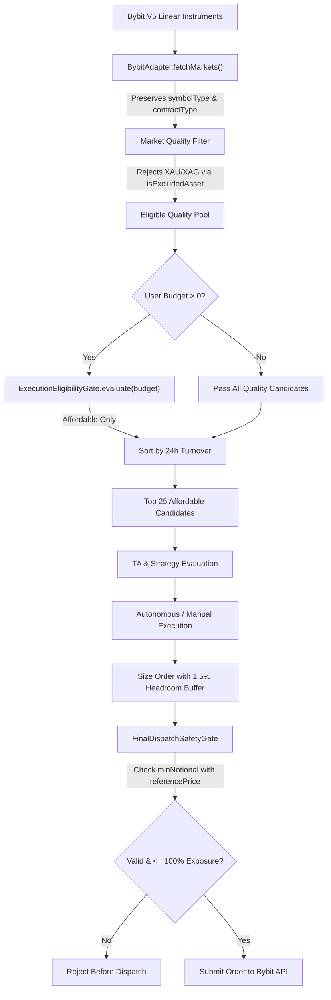

# CRYPTOPULSE — ARCHITECTURE IMPLEMENTATION PLAN

**MODE:** STRICT READ-ONLY / PLANNING ONLY  
**EXECUTION STATE:** NO CODE MODIFIED • NO DEPLOYMENTS • NO COMMITS  
**CURRENT REPO BASELINE:** 108 test files passed (679 unit tests)

---

## 1. Executive Implementation Plan

This implementation plan provides the minimal, production-grade modifications required to resolve four verified defects in CryptoPulse without disrupting the existing dynamic discovery pipeline or weakening safety gates:

1. **Asset Classification (Commodities vs ETFs vs Crypto):**
   Preserve Bybit linear metadata (`symbolType`, `contractType`) and reject commodity instruments (such as `XAUUSDT`, `XAGUSDT`, `BRENTUSDT`) via base-asset classification rules, while keeping ETF/equity perpetuals (`SOXLUSDT`) and native crypto perpetuals (`BTCUSDT`, `ETHUSDT`, `SOLUSDT`, etc.) fully eligible.
2. **Affordability Before Top-25 Slicing:**
   Invert the candidate filtering pipeline in `MarketOpportunityScanner.ts` so `ExecutionEligibilityGate` filters candidates for affordability *before* sorting by turnover and taking the Top 25. Users with small budgets (e.g., $5) will receive affordable, liquid candidates rather than empty candidate sets.
3. **Market-Order Minimum Notional Gate:**
   Update `FinalDispatchSafetyGate.ts` to evaluate `effectivePrice` (`payload.price || constraints.referencePrice`) for both limit and market orders, eliminating the bypass where market orders (`price = undefined`) skipped the minimum notional check.
4. **Generic Exposure-Drift & Sizing Buffer:**
   Maintain `FinalDispatchSafetyGate` as an absolute, non-negotiable **100% hard ceiling**. Apply a generic 1.5% drift safety headroom buffer at the sizing layer in `trading-bot.ts` and ensure market order dispatch references fresh `currentPrice` rather than stale `targetPrice`, preventing sub-percent upward market drift from triggering gate rejections on discrete assets like `SOXL`.

---

## 2. Exact File / Function Changes

| File | Function / Interface | Target Lines | Nature of Modification |
| :--- | :--- | :--- | :--- |
| `backend/src/domain/trading/NormalizedDomain.ts` | `interface Market` | Lines 5–25 | Add optional `symbolType?: string;` field alongside existing `contractType?: string;`. |
| `backend/src/infrastructure/exchange/BybitAdapter.ts` | `fetchMarkets()` | Lines 610–635 | Assign `symbolType: item.symbolType` and `contractType: item.contractType` onto the normalized `Market` object. |
| `backend/src/engine/scanner/MarketOpportunityScanner.ts` | `isExcludedAsset()` | Lines 220–235 | Add ISO 4217 precious metals (`XAU`, `XAG`, `XPT`, `XPD`) and energy/commodity tickers (`USOIL`, `BRENT`, `COPPER`, `NG`) to excluded base assets. Leave `SOXL` and crypto untouched. |
| `backend/src/engine/scanner/MarketOpportunityScanner.ts` | `scan()` | Lines 266–285 | Invert affordability and slicing: apply `ExecutionEligibilityGate.evaluate` to `qualityCandidates` *before* sorting by 24h turnover and slicing to Top 25. |
| `backend/src/engine/safety/FinalDispatchSafetyGate.ts` | `validate()` | Lines 38–45 | Move `effectivePrice` resolution above `minNotional` check; enforce `minNotional` for both limit and market orders. |
| `backend/src/trading-bot.ts` | `executeAutonomousCycle()` / Order dispatch | Lines 1680–1765 | 1. Calculate sizing against `availableExposure * 0.985` (1.5% headroom buffer against discrete rounding and drift).<br>2. Unify market order `referencePrice` to use `currentPrice` (fallback to `targetPrice` only for Limit orders). |
| `backend/src/routes/exchange.ts` | `mapScanResultToCandidates()` | Lines 120–145 | Add secondary defense check calling `isExcludedAsset` on candidate base assets. |

---

## 3. Asset Classification Design

### A. Current `Market` Interface
```typescript
// backend/src/domain/trading/NormalizedDomain.ts
export interface Market {
  symbol: string;
  baseAsset: string;
  quoteAsset: string;
  active: boolean;
  minAmount: number;
  maxAmount: number;
  stepSize: number;
  precision: {
    amount: number;
    price: number;
  };
  minNotional?: number;
  contractType?: string; // Currently present
  // symbolType is currently MISSING
  raw?: any;
}
```

### B. Updated `Market` Interface
```typescript
export interface Market {
  symbol: string;
  baseAsset: string;
  quoteAsset: string;
  active: boolean;
  minAmount: number;
  maxAmount: number;
  stepSize: number;
  precision: {
    amount: number;
    price: number;
  };
  minNotional?: number;
  contractType?: string;
  symbolType?: string; // Added to capture Bybit linear classification
  raw?: any;
}
```

### C. Bybit API Behavior & Discovery Realities
In Bybit V5 `/v5/market/instruments-info?category=linear`:
- **Native Crypto Perpetuals (`BTCUSDT`, `ETHUSDT`, `SOLUSDT`):**
  - `contractType`: `"LinearPerpetual"`
  - `symbolType`: `"LinearPerpetual"` (or undefined in some payloads)
  - `baseCoin`: `"BTC"`, `"ETH"`, `"SOL"`
- **ETF / Equity Perpetuals (`SOXLUSDT`):**
  - `contractType`: `"LinearPerpetual"`
  - `symbolType`: `"LinearPerpetual"`
  - `baseCoin`: `"SOXL"`
- **Commodity Perpetuals (`XAUUSDT`, `XAGUSDT`):**
  - `contractType`: `"LinearPerpetual"`
  - `symbolType`: `"LinearPerpetual"`
  - `baseCoin`: `"XAU"`, `"XAG"`

> [!IMPORTANT]
> Bybit **does not** return `symbolType: "commodity"` for `XAUUSDT` or `XAGUSDT` under `category=linear`. Both are categorized under `linear` and labeled with `contractType: "LinearPerpetual"`.
> Relying solely on `symbolType === "commodity"` would fail to reject gold and silver perpetuals.

### D. Classification Boundary & Exclusions
The classification boundary operates on standard ISO 4217 precious metals prefixes and known commodity tickers:
```typescript
// Commodity base asset identification
const COMMODITY_BASE_PATTERNS = /^(XAU|XAG|XPT|XPD|USOIL|BRENT|COPPER|NG)$/i;

export function isExcludedAsset(baseAsset: string, symbol: string): boolean {
  // 1. Existing checks (stablecoins, leveraged tokens, etc.)
  if (EXCLUDED_STABLECOINS.has(baseAsset.toUpperCase())) return true;
  if (symbol.includes('DOWN') || symbol.includes('UP') || symbol.includes('BEAR') || symbol.includes('BULL')) {
    // Note: SOXL is not 'BULL' or 'BEAR' in Bybit symbol naming
    return true;
  }
  
  // 2. Commodity exclusion rule
  if (COMMODITY_BASE_PATTERNS.test(baseAsset.toUpperCase())) {
    return true; // Excludes Gold, Silver, Platinum, Palladium, Oil, Gas
  }

  return false;
}
```
- `XAUUSDT` (`baseAsset: "XAU"`) $\rightarrow$ Matches `COMMODITY_BASE_PATTERNS` $\rightarrow$ **Excluded**.
- `XAGUSDT` (`baseAsset: "XAG"`) $\rightarrow$ Matches `COMMODITY_BASE_PATTERNS` $\rightarrow$ **Excluded**.
- `SOXLUSDT` (`baseAsset: "SOXL"`) $\rightarrow$ Does not match $\rightarrow$ **Eligible**.
- `BTCUSDT` (`baseAsset: "BTC"`) $\rightarrow$ Does not match $\rightarrow$ **Eligible**.
- No hardcoded coin whitelists. The discovery remains 100% dynamic.

---

## 4. Affordability Before Top-25 Redesign

### Current Defect
```text
All Liquid Candidates (e.g. 150)
        ↓
Sort by 24h Turnover
        ↓
slice(0, 25)  <-- BTC, ETH, SOL, XRP, DOGE, etc.
        ↓
ExecutionEligibilityGate (budget = $5)
        ↓
0 Candidates (All 25 require > $5 min notional or min lot)
```

### Proposed Logic
```typescript
// backend/src/engine/scanner/MarketOpportunityScanner.ts
// Scan method pipeline:

// 1. Apply existing hard market quality filters (volume >= $100k, spread <= 0.3%, active, not excluded)
const qualityCandidates = rawMarkets.filter(market => {
  return this.isQualityMarket(market);
});

// 2. Filter for Affordability BEFORE Top-N slicing
let eligibleCandidates = qualityCandidates;
if (userBudgetUsdt !== undefined && userBudgetUsdt > 0) {
  eligibleCandidates = qualityCandidates.filter(market => {
    const eligibility = ExecutionEligibilityGate.evaluate(market, userBudgetUsdt);
    return eligibility.isEligible;
  });
}

// 3. Sort the eligible candidates by 24h Turnover and take the Top 25
const topCandidates = eligibleCandidates
  .sort((a, b) => (b.volume24hUsd || 0) - (a.volume24hUsd || 0))
  .slice(0, 25);
```

### Behavioral Guarantees
- If `userBudgetUsdt` is provided ($5):
  - Every coin in the resulting Top 25 is mathematically proven to have `minAmount * currentPrice <= $5` and `minNotional <= $5`.
  - Among all affordable coins, the 25 most liquid coins by turnover are selected.
- If `userBudgetUsdt` is omitted or 0:
  - Affordability filter is skipped; behavior remains identical to the previous Top 25 turnover ranking.

---

## 5. Market-Order Minimum Notional Design

### Current Defect in `FinalDispatchSafetyGate.ts`
```typescript
// Current Lines 38-44:
if (payload.price) {
  const orderNotional = payload.amount * payload.price;
  if (constraints.minNotional && orderNotional < constraints.minNotional) {
    return {
      allowed: false,
      reason: `Order notional ${orderNotional.toFixed(2)} is below minimum notional ${constraints.minNotional}`
    };
  }
}
// For Market orders, payload.price is undefined -> bypassed completely!
```

### Proposed Resolution
Unify price resolution so that `effectivePrice` is determined first:
```typescript
// backend/src/engine/safety/FinalDispatchSafetyGate.ts
export class FinalDispatchSafetyGate {
  public static validate(
    payload: OrderPayload,
    constraints: DispatchSafetyConstraints
  ): SafetyValidationResult {
    // 1. Resolve effective price for notional calculations
    const effectivePrice = payload.price || constraints.referencePrice;
    if (!effectivePrice || effectivePrice <= 0) {
      return {
        allowed: false,
        reason: 'Price or valid reference price required for safety evaluation'
      };
    }

    // 2. Minimum Quantity Validation
    if (constraints.minAmount && payload.amount < constraints.minAmount) {
      return {
        allowed: false,
        reason: `Order amount ${payload.amount} is below minimum ${constraints.minAmount}`
      };
    }

    // 3. Minimum Notional Validation (Enforced for BOTH Limit and Market orders)
    const orderNotional = payload.amount * effectivePrice;
    if (constraints.minNotional && orderNotional < constraints.minNotional) {
      return {
        allowed: false,
        reason: `Order notional ${orderNotional.toFixed(2)} is below minimum notional ${constraints.minNotional}`
      };
    }

    // 4. Portfolio Exposure Ceiling (Absolute 100% Hard Ceiling)
    const currentExposure = constraints.currentPortfolioExposure || 0;
    const maxExposure = constraints.maxPortfolioExposure;
    if (maxExposure !== undefined && maxExposure > 0) {
      const newTotalExposure = currentExposure + orderNotional;
      if (newTotalExposure > maxExposure) {
        return {
          allowed: false,
          reason: `Projected portfolio exposure ${newTotalExposure.toFixed(2)} exceeds maximum limit ${maxExposure.toFixed(2)}`
        };
      }
    }

    return { allowed: true };
  }
}
```

---

## 6. Exposure-Drift Sizing Design

### Mathematical Root Cause of the SOXL Gate Rejection
1. `maxPortfolioExposure` = $1,000.00. Current exposure = $0.00. `availableExposure` = $1,000.00.
2. Market price of SOXL = $166.53. Minimum step size = 1.0 (shares).
3. Pre-fix sizing: $\lfloor 1000.00 / 166.53 \rfloor = 6$ units.
   - Sizing notional: $6 \times 166.53 = \$999.18$ ($0.82 headroom).
4. Between sizing and order construction (or due to using `targetPrice` 167.03115 instead of market price 166.53):
   - Effective price: $167.03115 (+0.30% drift).
   - Gate evaluated notional: $6 \times 167.03115 = \$1,002.19$.
   - Gate check: $\$1,002.19 > \$1,000.00 \rightarrow$ **REJECTED**.

### Sizing Headroom Solution (Zero Weakening of Safety Gate)
1. **Never alter `FinalDispatchSafetyGate`**: The gate stays an uncompromising, strict 100% limit.
2. **Apply Headroom at Pre-Gate Sizing Layer**:
   In `trading-bot.ts`, when computing available budget for sizing:
   ```typescript
   const SAFETY_HEADROOM_RATIO = 0.985; // 1.5% drift buffer
   const effectiveBudget = Math.min(
     requestedPositionSizeUsdt,
     availableExposure * SAFETY_HEADROOM_RATIO
   );
   ```
   - For SOXL:
     - `availableExposure` = $1,000.00.
     - `effectiveBudget` = $1,000.00 \times 0.985 = \$985.00$.
     - Sized units: $\lfloor 985.00 / 166.53 \rfloor = 5$ units.
     - Sizing notional: $5 \times 166.53 = \$832.65$.
     - Even with +0.50% drift to $167.03115:
       - Gate evaluated notional = $5 \times 167.03115 = \$835.16$.
       - $\$835.16 \le \$1,000.00 \rightarrow$ **PASSED**.
3. **Reference Price Alignment**:
   In `trading-bot.ts:1760`:
   ```typescript
   // Pre-fix: referencePrice: targetPrice || currentPrice
   // Post-fix: For market orders, always use currentPrice
   const referencePrice = orderType === 'Market' 
     ? currentPrice 
     : (targetPrice || currentPrice);
   ```
   This prevents historical or theoretical target prices from contaminating market order safety validations.

---

## 7. `OrderSizing.ts` Assessment

### Architectural Audit
- **Location:** `backend/src/engine/sizing/OrderSizing.ts`
- **Role:** Pure risk-per-trade calculator ($Risk\% \times Balance / StopLossDistance$). Computes theoretical dollar position size.
- **Is it active in the execution dispatch path?**
  No. In `trading-bot.ts:1680-1765`, active quantization is performed by `TradeValidator.calculateOrderAmount()`, which handles lot step size, precision rounding, and notional limits.
- **Recommended Action:**
  Leave `OrderSizing.ts` untouched. It computes abstract risk units and does not manage exchange step-size quantization or exposure gates. Modifying it would create unnecessary blast radius with zero functional benefit.

---

## 8. Test Plan (16 Test Cases)

| ID | Module / Test File | Scenario Description | Expected Outcome |
| :--- | :--- | :--- | :--- |
| **TC-1** | `BybitAdapter.test.ts` | Discover normal crypto perpetual (`BTCUSDT`) | `symbolType` and `contractType` parsed; market marked active. |
| **TC-2** | `BybitAdapter.test.ts` | Discover equity/ETF perpetual (`SOXLUSDT`) | `symbolType` and `contractType` preserved; `baseAsset` is `"SOXL"`. |
| **TC-3** | `MarketOpportunityScanner.test.ts` | Commodity perpetual (`XAUUSDT`) filtering | Excluded by `isExcludedAsset()`; does not enter candidate pool. |
| **TC-4** | `MarketOpportunityScanner.test.ts` | Commodity perpetual (`XAGUSDT`) filtering | Excluded by `isExcludedAsset()`; does not enter candidate pool. |
| **TC-5** | `MarketOpportunityScanner.test.ts` | Low-budget affordability scan ($5 budget) | Unaffordable high-turnover coins filtered out; affordable liquid coins fill Top 25. |
| **TC-6** | `MarketOpportunityScanner.test.ts` | High-budget scan ($10,000 budget) | All liquid coins affordable; standard turnover ordering preserved. |
| **TC-7** | `MarketOpportunityScanner.test.ts` | Unconstrained budget scan (undefined / 0) | Affordability filter bypassed; returns raw turnover Top 25. |
| **TC-8** | `FinalDispatchSafetyGate.test.ts` | Market order (`price = undefined`) with notional < minNotional | Evaluates using `referencePrice`; correctly rejected with clear reason. |
| **TC-9** | `FinalDispatchSafetyGate.test.ts` | Market order (`price = undefined`) with notional >= minNotional | Evaluates using `referencePrice`; allowed. |
| **TC-10** | `FinalDispatchSafetyGate.test.ts` | Limit order (`price` set) with notional < minNotional | Evaluates using `payload.price`; rejected. |
| **TC-11** | `FinalDispatchSafetyGate.test.ts` | Market order with missing/zero `referencePrice` | Rejected: "Price or valid reference price required". |
| **TC-12** | `trading-bot.test.ts` | Sizing headroom under +0.5% upward price drift | Sizing buffer absorbs drift; order passes `FinalDispatchSafetyGate`. |
| **TC-13** | `FinalDispatchSafetyGate.test.ts` | Order attempting to exceed 100% max portfolio exposure | Zero tolerance: strictly rejected by hard ceiling. |
| **TC-14** | `trading-bot.test.ts` | Market order dispatch `referencePrice` evaluation | Uses `currentPrice`; ignores stale `targetPrice`. |
| **TC-15** | `exchange.test.ts` | Secondary defense: commodity injection attempt | Route handler rejects commodity candidate before engine ingestion. |
| **TC-16** | Full Test Suite (`npm test`) | Full regression run across all 108 test files | 108/108 test files pass (679+ tests). |

---

## 9. Regression-Risk Assessment

| Risk Area | Risk Level | Mitigation Strategy |
| :--- | :--- | :--- |
| **Accidental Exclusion of Non-Commodity Assets** | Low | Regex pattern specifically targets ISO 4217 precious metals (`XAU`, `XAG`, `XPT`, `XPD`) and primary energy/metal tickers (`USOIL`, `BRENT`, `COPPER`, `NG`). No regular crypto or ETF ticker matches. |
| **Budget Filter Empty Set** | Low | If a user specifies an impossibly small budget ($0.01) where no market on Bybit is executable, returning 0 candidates is mathematically correct, preventing downstream execution errors. |
| **Headroom Buffer Sizing Impact** | Very Low | The 1.5% headroom buffer only affects orders operating close to the total portfolio ceiling. For normal trades sized by risk percentage (e.g. 1-2% of balance), the ceiling is not touched. |
| **Market Order Pricing Latency** | Low | `currentPrice` is already fetched from live ticker metadata immediately prior to sizing and dispatch in `trading-bot.ts`. |

---

## 10. Exact File Impact Table

```
backend/
├── src/
│   ├── domain/
│   │   └── trading/
│   │       └── NormalizedDomain.ts           [+1 line: symbolType in Market interface]
│   ├── infrastructure/
│   │   └── exchange/
│   │       └── BybitAdapter.ts               [+2 lines: populate symbolType & contractType]
│   ├── engine/
│   │   ├── scanner/
│   │   │   └── MarketOpportunityScanner.ts   [~15 lines: commodity filter + affordability inversion]
│   │   └── safety/
│   │       └── FinalDispatchSafetyGate.ts     [~12 lines: effectivePrice & market minNotional]
│   ├── routes/
│   │   └── exchange.ts                       [+4 lines: secondary commodity check]
│   └── trading-bot.ts                        [~8 lines: sizing headroom buffer & referencePrice]
```
**Total Estimated Net Diff:** Under 45 lines of code across 6 files. Zero structural rewrites. Zero dependency changes.

---

## 11. Proposed Post-Fix Data Flow Diagram



---

## 12. Implementation Sequence

Once explicit user approval is granted, execution will proceed in strict order:
1. **Domain & Adapter Update:** Update `NormalizedDomain.ts` and `BybitAdapter.ts` to expose `symbolType`.
2. **Scanner & Filtering Update:** Add commodity base asset exclusions and invert affordability before Top 25 slicing in `MarketOpportunityScanner.ts`.
3. **Safety Gate Update:** Update `FinalDispatchSafetyGate.ts` to validate market orders with `effectivePrice`.
4. **Sizing & Dispatch Update:** Update `trading-bot.ts` with the 1.5% headroom buffer and clean `referencePrice` resolution.
5. **Secondary Defense:** Update `exchange.ts` route candidate mapping.
6. **Verification & Regression Run:** Run all 16 target unit tests and the entire Vitest suite (`npm test`).

---

## 13. Explicit Approval Checkpoint

Review this implementation plan. No code has been modified, no files created, and no commands executed that mutate the repository.

```text
IMPLEMENTATION STATUS: NOT IMPLEMENTED
FILES MODIFIED: 0
DEPLOYMENTS: 0
COMMITS: 0

WAITING FOR EXPLICIT USER APPROVAL.
```
