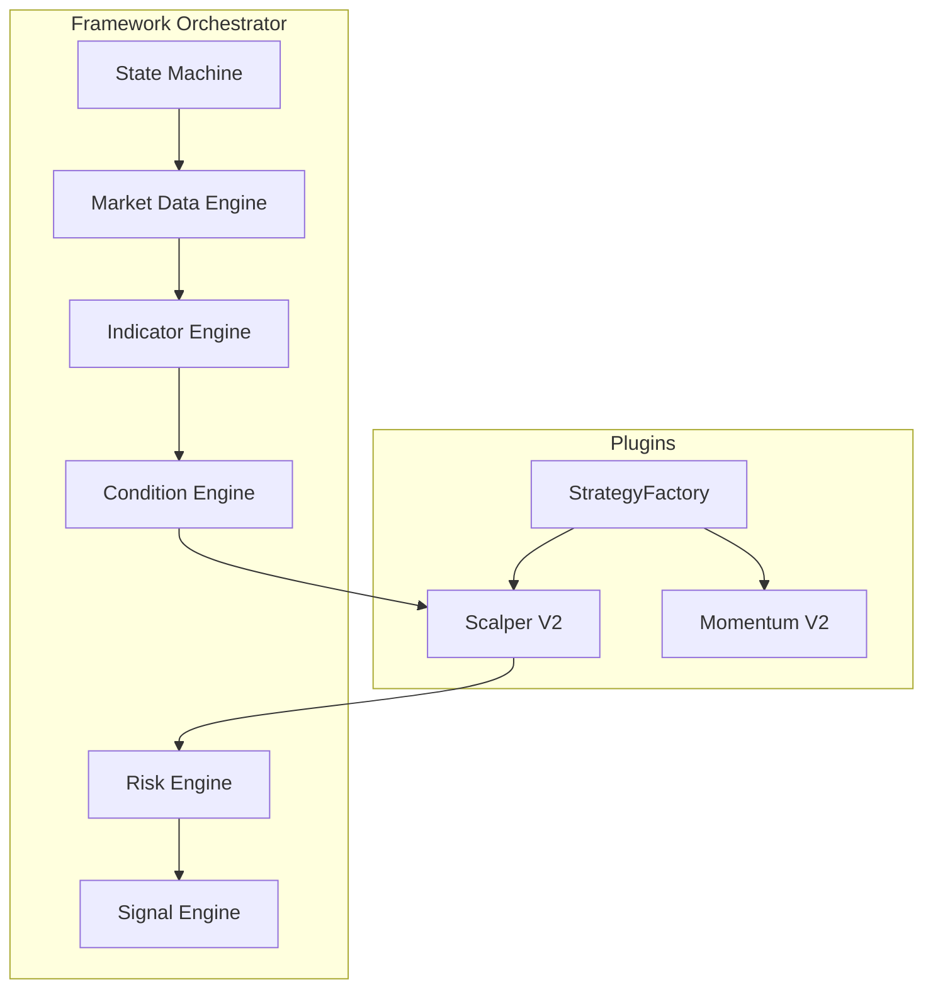
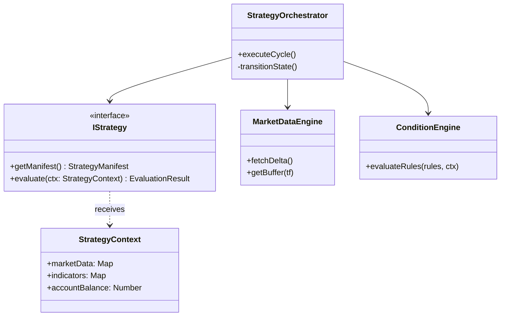
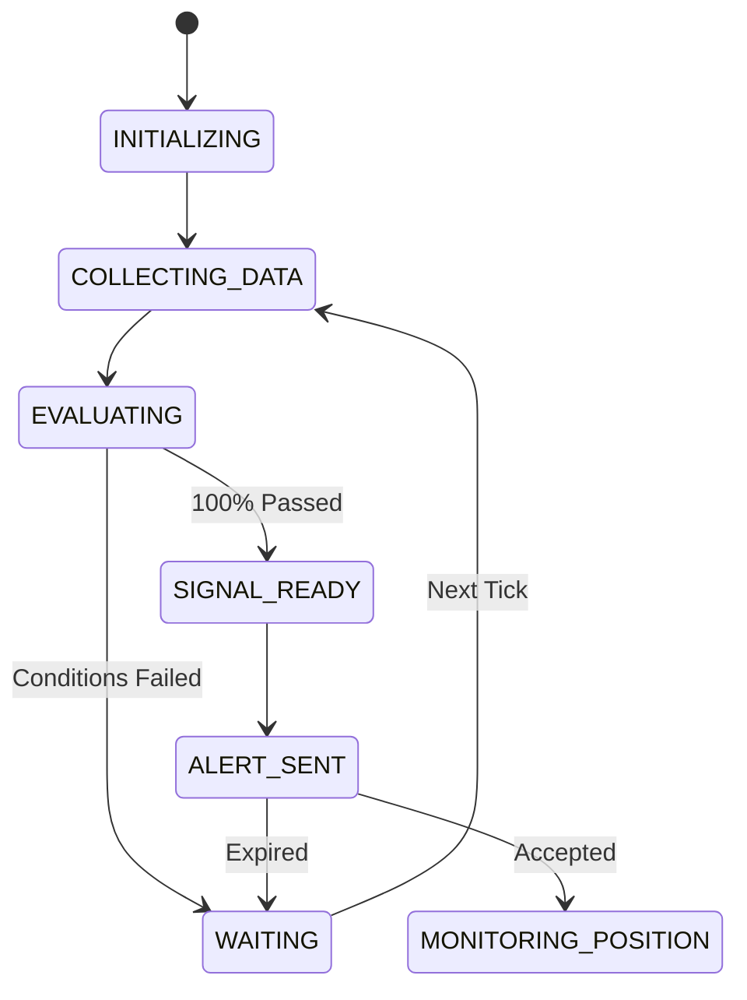

# Strategy Engine Technical Specification
**Version 1.0**  
**Status: FROZEN**

This document serves as the **single source of truth** and definitive engineering specification for the CryptoPulse Strategy Engine Framework. It details the complete architecture, data models, interfaces, and migration plan required to build a production-grade algorithmic trading core.

---

## 1. System Overview

The Strategy Engine Framework is a highly modular, event-driven orchestrator designed to decouple core trading logic from specific strategy rules. 

**Major Modules & Responsibilities:**
- **Orchestrator:** Manages the DO lifecycle and state machine.
- **Data Engine:** Manages REST/WS ingestion, OHLCV ring buffers, and MTF sync.
- **Indicator Engine:** Lazy-evaluates and caches technical indicators.
- **Condition Engine:** Evaluates dynamic boolean rules (ASTs) specific to a strategy.
- **Confidence Engine:** Weights condition outcomes to calculate "trade readiness."
- **Risk Engine:** Computes ATR stops, R:R limits, and dynamic position sizes.
- **Signal & Position Engine:** Manages TradeAlert deduplication, dispatch, and lifecycle.

**Design Principles:**
- **Strict Inversion of Control:** Strategies are stateless plugins. They do not fetch data or send alerts; they only receive a `StrategyContext` and return an `EvaluationResult`.
- **Memory Efficiency:** Shared circular buffers prevent memory leaks.
- **Determinism:** The UI receives the exact rule tree evaluated by the backend.



---

## 2. Complete Project Structure

```text
backend/src/engine/
├── StrategyOrchestrator.ts      // DO Entrypoint & State Machine
├── plugins/                     // Strategy Plugins
│   ├── IStrategy.ts             // Core Contract
│   ├── StrategyManifest.ts      // Metadata definition
│   ├── scalping/                // Scalper V2 Plugin
│   └── momentum/                // Momentum V2 Plugin
├── data/                        // Market Data Engine
│   ├── ExchangeAdapter.ts       // REST/WS Abstraction
│   ├── CircularBuffer.ts        // Memory-bounded OHLCV cache
│   └── MTFSynchronizer.ts       // Lower -> Higher TF aggregator
├── indicators/                  // Indicator Engine
│   ├── IndicatorCache.ts        // Timestamp-keyed cache
│   ├── BaseIndicator.ts         // Abstract Math class
│   └── math/                    // RSI, MACD, VWAP, EMA impls
├── rules/                       // Condition Engine
│   ├── ConditionEvaluator.ts    // AST Rule engine
│   └── ConfidenceCalculator.ts  // Weighting math
├── risk/                        // Risk Engine
│   ├── PositionSizer.ts         // minNotional & balance checks
│   └── StopLossCalculator.ts    // ATR Trailing / Dynamic SL
├── signal/                      // Signal & Position Engine
│   ├── AlertManager.ts          // Deduplication & Queue
│   └── PositionTracker.ts       // Open/Closed lifecycle
├── models/                      // Shared DTOs
│   ├── StrategyContext.ts       // Immutable evaluation context
│   └── ApiContracts.ts          // Android UI Schemas
└── utils/                       // Logging, Analytics, Testing
```

---

## 3. Class Diagram



---

## 4. Strategy Manifest

Every plugin exports a manifest declaring its requirements upfront. This prevents the engine from fetching unnecessary data.

```typescript
interface StrategyManifest {
  id: string;                  // 'scalper_v2'
  name: string;                // 'High-Frequency Scalper'
  version: string;             // '2.0.0'
  author: string;
  category: 'SCALP' | 'SWING';
  supportedExchanges: string[];// ['binance', 'bybit']
  supportedMarkets: string[];  // ['USDT-M', 'SPOT']
  baseTimeframe: string;       // '1m'
  macroTimeframes: string[];   // ['5m', '15m']
  requiredIndicators: string[];// ['vwap_1m', 'ema_9_1m']
  requiredMarketData: string[];// ['ticker', 'klines']
  riskProfile: {
    defaultRiskPct: number;    // 1% of account
    minRewardRatio: number;    // 2.0 (1:2 R:R)
  };
}
```

---

## 5. IStrategy Contract

The interface every strategy implements.

```typescript
interface IStrategy {
  // Returns the manifest so the Orchestrator knows what to prep
  getManifest(): StrategyManifest;
  
  // The core loop. Receives purely immutable data. 
  // Evaluates AST rules and returns the condition checklist.
  evaluate(ctx: StrategyContext): EvaluationResult;
  
  // Converts the EvaluationResult into a final Confidence (0-100)
  calculateConfidence(evalResult: EvaluationResult): number;
  
  // If Confidence == 100, maps the result to a TradeSignal
  generateSignal(evalResult: EvaluationResult, risk: RiskMetrics): TradeSignal | null;
}
```

---

## 6. Strategy Context

The `StrategyContext` is an immutable, frozen object created by the Orchestrator and passed into `evaluate()`. This guarantees side-effect-free evaluations.

Contains:
- `marketData`: Read-only access to the Ring Buffers.
- `indicators`: Pre-calculated values (e.g., `ctx.indicators.get('rsi_14_1m')`).
- `config`: User's specific overrides (e.g., custom volume thresholds).
- `risk`: User's available margin balance.

---

## 7. Market Data Engine

- **Architecture:** Wraps the Exchange APIs. Uses REST polling (`fetchKlines`) but defines a `pushTick()` method for seamless WebSocket integration later.
- **Ring Buffers:** `Float64Array` backed circular buffers to prevent memory fragmentation.
- **MTF Synchronization:** 1m ticks are mathematically aggregated into 5m/15m candles in memory.
- **Reconnection/Recovery:** If sequence IDs mismatch or a gap is detected, the buffer flushes and re-bootstraps via REST.

---

## 8. Indicator Engine

- **Lazy Evaluation:** If a strategy requests MACD, but the volume condition already failed, the MACD is not calculated.
- **Dependency Graph:** A Directed Acyclic Graph (DAG) resolves dependencies. (e.g., MACD requires EMA12 and EMA26).
- **Caching:** Calculated indicators are cached against the `candle_close_time`. If the candle hasn't closed, the indicator is recalculated on the delta tick.
- **NaN Handling Policy:** If a candle has 0 volume or missing data causing a `NaN` indicator output, the math pipeline returns `null`, and the corresponding `Condition` evaluation strictly returns `WAITING` (never a false positive `PASSED`).

---

## 9. Condition Engine

Strategies define their logic via `Condition` objects:

```typescript
interface Condition {
  id: string;           // 'vwap_cross'
  name: string;         // 'Price above VWAP'
  priority: 'MANDATORY' | 'OPTIONAL';
  evaluate: (ctx: StrategyContext) => boolean;
  getCurrentValue: (ctx: StrategyContext) => string;
  getTargetValue: () => string;
}
```
The Engine executes the array of Conditions. It short-circuits if a `MANDATORY` condition fails early (saving CPU).

---

## 10. Confidence Engine

Instead of generic weighting, `ConfidenceCalculator` uses the strategy's defined weights.
- `MANDATORY` conditions do not add to confidence; they are binary gates (Must be TRUE to trade).
- `OPTIONAL` (Confluence) conditions contribute to the 0-100% score (e.g., "1H Trend Alignment = +20%").
- **Trade Readiness:** Signal generation only unlocks if `Mandatory == ALL_PASSED` and `Confidence >= Threshold`.

---

## 11. Risk Engine

Provides a global `PositionSizer`.
- **ATR Stop Loss:** `SL = EntryPrice - (ATR(14) * 1.5)`.
- **Position Sizing:** `Risk Amount ($) = Balance * 0.01`. `Size = Risk Amount / (Entry - SL)`.
- **Validation:** Rejects signals where `Size < Exchange.minNotional`.

---

## 12. Signal Engine

Manages the Alert lifecycle.
- **Duplicate Detection:** Hashes `StrategyID + Coin + CandleTime`.
- **Queue:** Pushes to D1-backed DO Storage.
- **Expiration:** Alerts expire if `abs(CurrentPrice - Entry) > ATR` before user approval.

---

## 13. Position Engine

Maintains the state of trades *after* the signal is accepted.
- States: `PENDING_OPEN`, `OPEN`, `PARTIAL_FILLED`, `CLOSED`, `CANCELLED`.
- **Exchange Integration & State Transitions:** State transitions are driven purely by Exchange Webhook payloads (e.g., Binance Execution Reports) received via an ingress route. Polling is strictly forbidden to preserve DO compute limits and ensure real-time accuracy.

---

## 14. Strategy State Machine

The DO operates as a strict FSM.



---

## 15. Android API Contract

The UI is a dumb renderer. The API emits this JSON schema exactly:

**Active Alert Schema Definition:**
```typescript
interface ActiveAlert {
  id: string;
  symbol: string;
  entryPrice: number;
  stopLoss: number;
  takeProfit: number;
  positionSize: number;
  estimatedPnl: number;
  side: 'BUY' | 'SELL';
  strategy: string;
  expiresAt: number; // Unix timestamp 
}
```

**GET `/api/v1/bot/:id/live-status`**
```json
{
  "botStatus": "EVALUATING",
  "strategyName": "Scalper V2",
  "symbol": "BTCUSDT",
  "livePrice": 64200.50,
  "confidenceScore": 80,
  "progressPercent": 80,
  "etaSeconds": 15,
  "conditions": [
    {
      "id": "c1",
      "name": "1m Price > VWAP",
      "currentValue": "64200.50",
      "targetValue": "> 64180.00",
      "status": "PASSED"
    },
    {
      "id": "c2",
      "name": "5m RSI < 30",
      "currentValue": "45.0",
      "targetValue": "< 30.0",
      "status": "WAITING"
    }
  ],
  "activeAlert": null // Populated with ActiveAlert object when triggered
}
```

---

## 16. Database Design (D1)

**Memory (DO Isolate):** OHLCV Buffers, Indicator Caches.
**Persistence (D1/DO Storage):**
- `users` (Credentials)
- `bot_config` (Active Strategy, Coin, Risk Params)
- `trade_signals` (Historical alerts and PnL)
- `audit_logs` (System events)

---

## 17. Logging & Analytics

- **Structured Logging:** Emits JSON lines (`{ level, timestamp, traceId, event }`).
- **Timing:** Wraps `evaluate()` with `performance.now()` to ensure CPU time remains `< 50ms`.

---

## 18. Error Handling

- **Exchange 429/500:** Exponential backoff. State moves to `COLLECTING_DATA (RETRY)`.
- **Buffer Corruption:** If timestamps jump, flush the Ring Buffer and reboot.
- **Circuit Breaker:** 5 consecutive failures trips the Global Kill Switch.

---

## 19. Testing Strategy

- **Historical Replay (Backtesting Hooks):** The `IStrategy.evaluate()` takes an immutable context. We will feed 1 year of historical `StrategyContext` objects into the engine in a `jest` loop to assert Win Rate and Drawdown without hitting the network.
- **Unit Tests:** Math validation for VWAP/ATR against TradingView data.

---

## 20. Migration Plan

**Phase 1: Co-existence**
Build the `engine/` folder structure alongside the existing `trading-bot.ts`.

**Phase 2: Shadow Mode**
Run `Scalper V2` in the background alongside the old engine. Compare execution speed and signal accuracy.

**Phase 3: Routing Swap**
Update the `/activate` route to instantiate the new Framework. The old 6-checkpoint logic is deprecated.

---

## 21. Future Roadmap

- **WebSockets:** Implement `pushTick()` for zero-latency execution.
- **AI Integration:** Add `MachineLearningCondition` that calls an external Python gRPC service for a tensor prediction, fitting seamlessly into the existing `Condition` interface.

---

## 22. Professional Comparison

**Institutional Alignment:**
- Event-driven FSM.
- Immutable Context injection (perfect for backtesting).
- Memory-bounded Ring Buffers.

**Remaining Gaps:**
- Co-location: DOs run at Cloudflare edges, which is fast, but true HFT requires bare-metal servers inside the Exchange data center.
