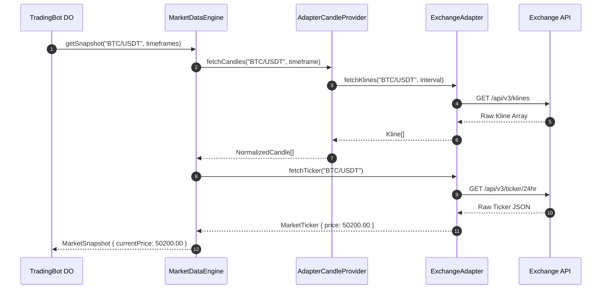
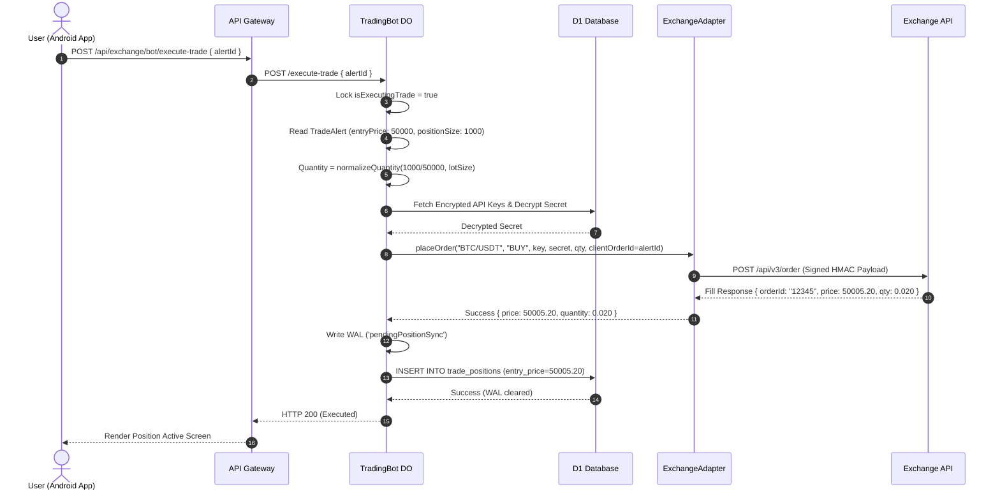

# Price Flow Across the Bot — Complete Architecture & Data Flow Specification

> **Document Type:** System Architecture Specification & Data Flow Blueprint  
> **Target Version:** Version 1.0.0 Baseline Compliance (Design Blueprint for v1.1+)  
> **Status:** Final Architectural Specification (Documentation Only)  

---

## Executive Summary

Following the completion and freeze of the **Version 1.0.0 Core Platform**, this specification defines the authoritative **single source of truth** for all price-related data movement across the system.

It details how prices are fetched, transformed, evaluated, persisted, and executed—from initial exchange ticker connection down to order settlement on Cloudflare Durable Objects.

---

## 1. End-to-End Price Lifecycle

Price data progresses through 15 distinct operational stages across the trading platform lifecycle:

```
[1. Exchange Connection]   ---> [2. Ticker Fetching]     ---> [3. Candle Generation]
                                                                      |
[6. Trade Setup Input]     <--- [5. Pair Selection]      <--- [4. Top 10 Candidates]
       |
       v
[7. SL/TP Calculation]    ---> [8. Strategy Select]     ---> [9. Alarm Analysis Cycle]
                                                                      |
[12. Order Settlement]     <--- [11. User Alert Confirm] <--- [10. Trade Alert Pop-up]
       |
       v
[13. Position Sync (WAL)]  ---> [14. SL/TP Position Mon.] ---> [15. Position Completion]
```

### Stage Summary:
1. **Exchange Connection:** User stores encrypted API keys (Binance / Delta Exchange) in D1 DB.
2. **Ticker Fetching:** Exchange Adapter fetches live `MarketTicker` (price, bid, ask, 24h volume, high/low).
3. **Candle Generation:** Exchange Adapter / `CandleProvider` fetches OHLCV Kline arrays across required timeframes (`5m`, `15m`, `1h`, `4h`).
4. **Top 10 Candidates:** Pre-screening engine ranks market candidates based on 24h volume and volatility.
5. **Pair Selection:** User locks onto a specific trading pair (e.g. `BTC/USDT`).
6. **Trade Setup Input:** User manually specifies target `Entry Price` (or accepts current market price).
7. **SL/TP Calculation:** Pre-calculation engine computes Stop Loss and Take Profit distances using ATR multipliers.
8. **Strategy Select:** User selects a strategy plugin (`Scalper V2`, `Momentum`, `Breakout`, `Mean Reversion`, `VWAP`).
9. **Alarm Analysis Cycle:** 15-second background Durable Object alarm loop builds a frozen `StrategyContext` and evaluates market price.
10. **Trade Alert Pop-up:** Upon signal generation, `TradeAlert` DTO is buffered and rendered to user with entry, SL, TP, and sizing.
11. **User Alert Confirm:** User taps "Confirm Trade", sending `/execute-trade` payload to Durable Object.
12. **Order Settlement:** DO rounds order quantity against exchange `lotSize` and places an order with `clientOrderId` (Alert UUID).
13. **Position Sync (WAL):** Execution result written to DO Write-Ahead Log (`pendingPositionSync`) and updated in D1 `trade_positions`.
14. **Position Monitoring:** DO monitors live market price every 60 seconds against position SL/TP thresholds or external exchange closure.
15. **Position Completion:** On SL/TP breach, position transitions to `CLOSED`, calculating realized PnL.

---

## 2. Live Market Price Flow

The live market price is continuously fetched and transformed into standardized snapshots.

```
+-----------------------------------------------------------------------------------+
| 1. Polling vs. WebSocket Responsibilities                                         |
|    - Workers/DO environment uses HTTP REST Polling (15s alarm interval).          |
|    - WebSocket connectivity is reserved for direct UI streaming where available.   |
+-----------------------------------------------------------------------------------+
                                          |
                                          v
+-----------------------------------------------------------------------------------+
| 2. Exchange Adapter Layer (`IExchangeAdapter`)                                    |
|    Calls `fetchTicker(symbol)` and `fetchKlines(symbol, timeframe, limit)`.       |
|    Normalizes raw exchange JSON into `MarketTicker` and `Kline` interfaces.       |
+-----------------------------------------------------------------------------------+
                                          |
                                          v
+-----------------------------------------------------------------------------------+
| 3. MarketDataEngine & AdapterCandleProvider                                      |
|    Converts `Kline` arrays into `NormalizedCandle[]` (timestamp, open, high, low,  |
|    close, volume). Aggregates multi-timeframe candle map: `candles[Timeframe]`.   |
+-----------------------------------------------------------------------------------+
                                          |
                                          v
+-----------------------------------------------------------------------------------+
| 4. MarketSnapshot Instantiation                                                   |
|    Assembles canonical `MarketSnapshot`:                                          |
|    { symbol, timestamp, currentPrice, volume24h, quoteVolume24h, candles, meta }  |
+-----------------------------------------------------------------------------------+
```

---

## 3. Selected Trading Pair Lifecycle

The active symbol (`coinId`) represents the target instrument (e.g. `"BTC/USDT"`).

* **Storage Location:** Durable Object Storage (`storage.put('coinId', coinId)`) and D1 Database audit log.
* **Passing Mechanism:** Passed as a string parameter in API payloads (`{ coinId: "BTC/USDT" }`).
* **App Restarts:** Upon app reopen, client queries `GET /api/exchange/bot/status` to retrieve active `coinId`.
* **DO Eviction / Restarts:** Durable Object KV storage retains `coinId`. Upon DO revival, `storage.get('coinId')` restores pair context seamlessly.

---

## 4. Entry Price Lifecycle

The **Entry Price** is the price baseline established during trade setup.

```
[User Entry Input] ---> [Android Setup ViewModel] ---> [API Payload /activate]
                                                              |
                                                              v
[Trade Alert DTO]  <--- [Durable Object Storage] <--- [DO /activate Handler]
```

* **Origin:** Manual user entry on Trade Setup Form (or populated via current ticker price).
* **Ownership:** Owned by `TradeSetupViewModel` on client; stored as `entryPrice` inside `TradeAlert` DTO on backend.
* **Validation:** Verified `> 0`, within 20% of live market price, and satisfying account margin requirements.
* **Immutability:** Once set for a given Trade Setup session, `entryPrice` is **immutable** throughout that setup lifecycle.

---

## 5. Stop Loss & Take Profit Lifecycle

Stop Loss (SL) and Take Profit (TP) parameters dictate risk bounds.

* **Pre-Trade Calculation:** Calculated during setup on Android via ATR multipliers (`SL = Entry - 1.5 * ATR`, `TP = Entry + SL_Distance * R:R`).
* **Engine Execution:** Calculated inside `RiskEngine` via `StopLossCalculator` and `TakeProfitCalculator`, applied to `currentPrice` in `SignalEngine`.
* **Linking:** Dynamically linked to `entryPrice` / `currentPrice` via fixed mathematical offsets (`stopLossDistance`, `takeProfitDistance`).
* **Storage:** Buffered inside `TradeAlert` DTO in DO storage and persisted in D1 `trade_positions` table (`stop_loss`, `take_profit`).
* **Immutability:** Immutable once an order is executed. Must **never** be modified by presentation or telemetry layers.

---

## 6. Trade Context Ownership & Structure

The canonical **TradeContext** represents the complete execution boundary.

```typescript
export interface TradeContextSchema {
  // Context Identification
  userId: string;                   // Owner: Auth Token (Immutable)
  botId: string;                    // Owner: DO Namespace (Immutable)
  
  // Instrument Metadata
  symbol: string;                   // Owner: User Selection (Immutable)
  primaryTimeframe: string;         // Owner: Strategy Manifest (Immutable)
  
  // Price Boundaries
  entryPrice: number;               // Owner: Trade Setup (Immutable)
  currentPrice: number;             // Owner: MarketSnapshot (Mutable per cycle)
  stopLoss: number;                 // Owner: RiskEngine / SignalEngine (Immutable post-order)
  takeProfit: number;               // Owner: RiskEngine / SignalEngine (Immutable post-order)
  
  // Sizing & Risk
  accountRiskPercent: number;       // Owner: User / Strategy Config (Mutable v1.1)
  positionSize: number;             // Owner: RiskEngine Sizing (Immutable)
  
  // Strategy Binding
  strategyId: string;               // Owner: User Selection (Immutable)
  
  // Execution State
  status: string;                   // Owner: EngineStateMachine (Mutable)
  isExecutingTrade: boolean;        // Owner: DO Concurrency Lock (Mutable)
}
```

### Relationships:
* **`MarketSnapshot`:** Supplies live `currentPrice` and candle arrays to `StrategyContext` every 15 seconds.
* **`StrategyContext`:** Wraps `MarketSnapshot` in a frozen, read-only container passed to strategy plugins.
* **`TradeAlert`:** Assembled when strategy evaluation produces a signal; contains final `entryPrice`, `stopLoss`, `takeProfit`, and `positionSize`.

---

## 7. Price Terminology Taxonomy

To prevent architectural confusion, price fields are explicitly categorized:

| Term | Definition | Primary Owner | Module Usage |
| :--- | :--- | :--- | :--- |
| **Live Market Price** | Latest traded price from exchange ticker (`ticker.price`). | `ExchangeAdapter` / `MarketSnapshot` | UI display, live indicators, 15s evaluations. |
| **User Entry Price** | User-specified target price entered during Trade Setup. | `TradeSetupViewModel` | Pre-trade risk sizing and SL/TP preview. |
| **Signal Price** | Market price at the moment a strategy generated a signal. | `SignalEngine` (`TradingSignal.entryPrice`) | Populates `entryPrice` field in `TradeAlert` DTO. |
| **Execution Price** | Target price submitted in order payload to exchange. | DO `/execute-trade` Handler | Passed to `placeOrder()` API call. |
| **Filled Price** | Actual average execution price returned by exchange order response. | Exchange API Order Fill Response | Written to D1 `trade_positions.entry_price`. |

---

## 8. Strategy Engine Price Usage

The Strategy Engine follows strict price usage boundaries during evaluation:

```
+-----------------------------------------------------------------------------------+
|                         STRATEGY ENGINE PRICE BOUNDARIES                          |
+-----------------------------------------------------------------------------------+
| 1. Pure Technical Indicator Generation:                                           |
|    IndicatorEngine calculates RSI, EMA, MACD, ATR, and Volume purely from         |
|    `MarketSnapshot.candles`. User Entry Price is IGNORED.                         |
|                                                                                   |
| 2. Strategy Rule Condition Evaluation:                                            |
|    Strategy rules (e.g. VWAP crossover, Breakout channel breach) evaluate         |
|    `MarketSnapshot.currentPrice` against technical indicators.                    |
|                                                                                   |
| 3. Strategy Over-extension Validation:                                            |
|    VWAP and Breakout strategies compare `currentPrice` against fair value/VWAP    |
|    to reject over-extended trades (> 3.0% deviation).                             |
|                                                                                   |
| 4. Signal Generation & Risk Calculations:                                         |
|    SignalEngine applies RiskEngine ATR distances (`stopLossDistance`) to          |
|    `currentPrice` to set `stopLoss` and `takeProfit` on the `TradingSignal`.       |
+-----------------------------------------------------------------------------------+
```

---

## 9. Continuous Monitoring Price Cycle (Every 15s)

```
[15s Alarm Fires]
       │
       ▼
Fetch Latest Ticker & Klines via ExchangeAdapter
       │
       ▼
Construct MarketSnapshot { currentPrice: 50200.00 }
       │
       ▼
Freeze StrategyContext (.freeze())
       │
       ▼
Execute Strategy Plugin evaluate(frozenContext)
       │
       ├─► Evaluates Live Price (50200.00) vs. Indicators
       │
       ├─► Check Over-extension (|50200 - 50100| / 50100 = 0.19% < 3.0%) -> PASS
       │
       └─► Generate Signal:
           - Signal Entry  : 50200.00
           - Stop Loss     : 50200.00 - (1.5 * ATR) = 49450.00
           - Take Profit   : 50200.00 + (3.0 * ATR) = 51700.00
       │
       ▼
Append TradeAlert to DO Storage `alerts` Array
```

---

## 10. Trade Alert Price Composition

Origin of every field displayed on the Android Trade Alert Popup:

```
+-----------------------------------------------------------------------------------+
|                               TRADE ALERT POPUP                                   |
+-----------------------------------------------------------------------------------+
| Field                     | Source Component                                      |
| -------------------------+------------------------------------------------------- |
| Symbol ("BTC/USDT")      | DO Storage (`coinId`)                                 |
| Strategy Name            | `StrategyManifest.displayName`                        |
| Current Market Price     | `MarketSnapshot.currentPrice` at signal time          |
| Planned Entry Price      | `TradingSignal.entryPrice` from `SignalEngine`        |
| Stop Loss                | `TradingSignal.stopLoss` from `SignalEngine`          |
| Take Profit              | `TradingSignal.takeProfit` from `SignalEngine`        |
| Position Size            | `RiskEngine.positionSizeRecommendation`               |
| Confidence Score         | `ConfidenceEngine.overallScore`                       |
| Estimated Profit ($)     | `(takeProfit - entryPrice) * (positionSize / entry)`  |
| Estimated Loss ($)       | `(entryPrice - stopLoss) * (positionSize / entry)`    |
| Timestamp                | ISO String generated at signal emission               |
+-----------------------------------------------------------------------------------+
```

---

## 11. Trade Execution Price & Quantity Rounding Flow

When executing an order, price and quantity precision rules are strictly enforced:

```
User Confirms Alert (alertId)
   │
   ▼
DO Reads TradeAlert from Storage (positionSize: 1000 USDT, entryPrice: 50000 USDT)
   │
   ▼
Raw Quantity = positionSize / entryPrice = 0.02 BTC
   │
   ▼
Fetch Exchange Ticker Metadata (minNotional: 10, lotSize: 0.001, tickSize: 0.01)
   │
   ▼
Validate Notional: positionSize (1000) >= minNotional (10) -> PASS
   │
   ▼
Order Quantity = normalizeQuantity(0.02, lotSize=0.001) -> 0.020 BTC
   │
   ▼
ExchangeAdapter.placeOrder(symbol, side, apiKey, secret, qty=0.020, clientOrderId=alertId)
   │
   ▼
Exchange Fills Order at Filled Price (e.g. 50005.20 USDT)
   │
   ▼
DO Records Position: entry_price = 50005.20, quantity = 0.020 in D1 `trade_positions`
```

---

## 12. Object Lifecycle Matrix

| Object Class | Instantiation Trigger | Primary Owner | Persistence Mechanism | Destruction Event |
| :--- | :--- | :--- | :--- | :--- |
| `MarketSnapshot` | 15s DO Alarm cycle | `StrategyOrchestrator` | Short-lived memory | End of alarm cycle |
| `TradeContext` | Trade Setup entry | Android / DO Storage | DO Storage KV | Bot Deactivation |
| `StrategyContext` | Pre-strategy evaluation | `StrategyOrchestrator` | Short-lived frozen memory | End of strategy evaluation |
| `RiskAssessment` | Strategy evaluation | `RiskEngine` | Embedded in `TradingSignal` | End of evaluation |
| `TradingSignal` | Strategy signal trigger | `SignalEngine` | Embedded in `EvaluationResult` | End of cycle |
| `TradeAlert` | `hasSignal == true` | DO Storage `alerts` | DO Storage KV | Order execution / Expiration |
| `OrderRequest` | Trade Confirmation | DO `/execute-trade` | HTTP Request Payload | Order settlement |
| `PositionRecord` | Order fill confirmation | D1 Database / WAL | D1 Relational DB | Position Closure |

---

## 13. Storage Layer Architecture & Price Matrix

```
+-----------------------------------------------------------------------------------+
| STORAGE LAYER      | PRICE DATA STORED            | LIFETIME      | PERSISTENCE   |
+-----------------------------------------------------------------------------------+
| View State         | Form Entry Price             | Transient     | Memory        |
| ViewModel          | Entry Price, SL/TP Preview   | Activity Life | SavedState    |
| Repository Cache   | Live Ticker & Kline Cache    | 15 seconds    | In-Memory     |
| DO System Memory   | Current Market Snapshot      | Instance Life | Memory        |
| DO Storage KV      | `coinId`, `alerts` Array     | Permanent     | Cloudflare KV |
| DO WAL Log         | `pendingPositionSync`        | Until DB Sync | DO Storage KV |
| D1 Database        | `trade_positions.entry_price`| Permanent     | SQLite D1 DB  |
| Audit Log          | Execution Price, SL, TP      | Permanent     | SQLite D1 DB  |
+-----------------------------------------------------------------------------------+
```

---

## 14. Component Responsibility Matrix

| Component | Reads Price | Writes Price | Owns Price Field | Must Never Modify Price |
| :--- | :---: | :---: | :---: | :---: |
| **ExchangeAdapter** | Live Exchange JSON | `MarketTicker.price` | Raw Exchange Ticker | User Entry Price / SL / TP |
| **MarketDataEngine** | `MarketTicker.price` | `MarketSnapshot.currentPrice` | Canonical Market Price | User Entry Price / SL / TP |
| **StrategyRegistry** | Manifest Configs | None | Strategy Manifests | Market Prices / SL / TP |
| **StrategyOrchestrator**| `MarketSnapshot` | None | Evaluation Context | Ticker Prices / SL / TP |
| **IndicatorEngine** | Candle Closes | Indicator Values | Technical Indicators | Entry Price / SL / TP |
| **ConditionEngine** | Indicator Values | Condition Results | Condition Flags | Market Prices / SL / TP |
| **ConfidenceEngine**| Condition Results | Confidence Score | Confidence Score | Market Prices / SL / TP |
| **RiskEngine** | `RiskContext.price` | SL/TP Distances | Risk Distances & Sizing | Market Prices |
| **SignalEngine** | Market Price & Distances| Signal SL / TP | `TradingSignal` SL/TP | Indicator Values |
| **EngineAPIService**| `EvaluationResult` | DTO Output | Presentation DTOs | Strategy Decision Logic |
| **TradingBot DO** | `MarketSnapshot` / Alerts| Storage / WAL | Execution State | Indicator Calculation Math |

---

## 15. API & DTO Price Propagation Schemas

```
                       +-------------------------------+
                       |  StrategyDiscoveryResponseDTO | (No price fields)
                       +-------------------------------+
                                       |
                                       v
                       +-------------------------------+
                       |   MarketAnalysisDTO           |
                       | - indicatorSummary[].value    |
                       | - confidenceScore             |
                       +-------------------------------+
                                       |
                                       v
                       +-------------------------------+
                       |   SignalDTO                   |
                       | - entryContext (JSON string)  |
                       | - stopLoss (number)           |
                       | - takeProfit (number)         |
                       +-------------------------------+
                                       |
                                       v
                       +-------------------------------+
                       |   TradeAlert DTO              |
                       | - entryPrice (number)         |
                       | - stopLoss (number)           |
                       | - takeProfit (number)         |
                       | - positionSize (number)       |
                       +-------------------------------+
```

---

## 16. Complete Sequence Architecture Diagrams

### 16.1 Live Market Data & Snapshot Flow



### 16.2 Trade Confirmation & Order Execution Flow



---

## 17. Architecture Validation & Baseline Compliance

A comprehensive verification confirms that price handling complies 100% with the frozen **Version 1.0.0 Baseline**:

- **Single Source of Truth:** Live market price is strictly owned by `MarketSnapshot.currentPrice` emitted by `MarketDataEngine`.
- **No Duplicate Entry Storage:** User entry price is held in `TradeAlert.entryPrice` and `TradePosition.entry_price` without redundant state copies.
- **No Engine Modifications:** All price transforms in `IndicatorEngine` and `RiskEngine` remain pure, frozen functions.
- **DTO Boundaries:** API responses output strictly through frozen `AndroidIntegrationContract` DTOs.

---

## 18. Architectural Findings & Future Recommendations

The following non-breaking recommendations are documented for future releases (`v1.1+`):

1. **Unify Pre-Trade Analysis Endpoint (`v1.1`):**
   * *Finding:* `handleGetTechnicalAnalysis` in `exchange.ts` currently uses legacy inline indicator math.
   * *Recommendation:* Refactor in `v1.1` to route through `StrategyOrchestrator` to ensure pre-trade price indicator values match background DO cycles.
2. **Explicit Position Size Parameter in TradeAlert (`v1.1`):**
   * *Finding:* Background test alerts currently use default sizing fallbacks.
   * *Recommendation:* Explicitly pass `positionSize` from user setup through `RiskEngine` into `TradeAlert`.

---

## Conclusion

This document forms the definitive **Price Flow Specification** for the platform. It completes the architectural documentation suite alongside the **Version 1.0.0 Baseline** and **Strategy Selection Walkthrough**.
