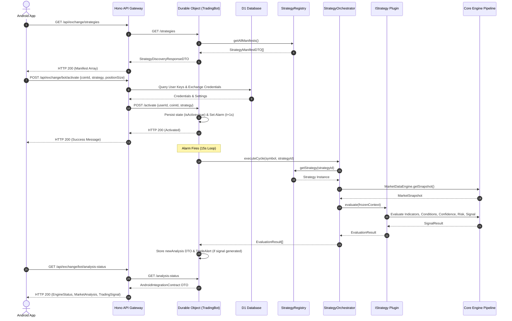

# Strategy Selection / Strategy Setup — Architectural Specification & Design Reference

> **Document Type:** System Specification & Architectural Reference  
> **Target Version:** Version 1.0.0 Baseline (Design Foundation for v1.1+)  
> **Status:** Final Architectural Specification (Documentation Only)  

---

## Executive Summary

Following the official freeze of the **Version 1.0.0 Core Platform**, this specification defines the complete architectural and user experience foundation for the **Strategy Selection / Strategy Setup** module.

This document serves as the permanent source of truth for how strategies are discovered, presented, configured, validated, and activated across the Android Client, API Gateway, and Cloudflare Durable Objects runtime. It ensures absolute decoupling between presentation and execution, strictly maintaining Android as a pure presentation layer.

---

## 1. Strategy Comparison Matrix

The platform provides five core strategy plugins, each tailored to distinct market regimes, volatility environments, and risk appetites.

| Strategy Name | Category | Best Market Conditions | Risk Profile | Supported Timeframes | Typical Holding Time | Expected Trade Frequency | Primary Indicators | Strengths | Limitations | Best Use Case |
| :--- | :--- | :--- | :--- | :--- | :--- | :--- | :--- | :--- | :--- | :--- |
| **Scalper V2** | Scalping | High liquidity, low spread, active intraday volatility | Medium | `1m`, `3m`, `5m`, `15m` | 5 mins – 1 hour | High (5–20 / day) | EMA(20,50), RSI(14), ATR(14) | Fast execution, tight risk bounds, minimizes overnight exposure | High slippage sensitivity, poor in flat markets | Rapid intraday momentum spikes in high-volume crypto pairs |
| **Momentum** | Trend Following | Strong directional trends with expanding volume | Medium | `5m`, `15m`, `1h` | 1 hour – 12 hours | Medium (1–5 / day) | MACD(12,26,9), EMA(20,50), RSI(14) | High reward-to-risk ratio, rides extended trends | High drawdowns during sudden market reversals | Trending markets following major news or technical breakouts |
| **Breakout** | Channel / Range | Compression regimes transitioning to expansion | High | `15m`, `1h`, `4h` | 2 hours – 24 hours | Low-Medium (1–3 / day) | Donchian/S/R Channels, SMA(50,200), Volume MA(20) | Captures explosive moves early at key structural levels | Vulnerable to false breakouts ("whipsaws") in low volume | Post-consolidation volatility expansions on major market levels |
| **Mean Reversion** | Reversal / Oscillator | Extended range-bound markets, overbought/oversold extremes | Medium | `15m`, `1h`, `4h` | 1 hour – 8 hours | Medium (2–6 / day) | RSI(14), EMA(20,50), ATR(14) | Excellent entry pricing at extremes, tight stop bounds | Performs poorly during strong, sustained unidirectional trends | Oscillating sideways markets between defined support and resistance |
| **VWAP** | Institutional / Fair Value | Intraday institutional volume alignment | Medium | `15m`, `1h`, `4h` | 30 mins – 6 hours | Medium (2–4 / day) | VWAP, RSI(14), Volume MA(20), ATR(14) | Anchored to volume-weighted fair value, filters low-volume noise | Requires continuous volume data; extended prices reject entries | High-volume trading hours around fair value mean reversion/crossover |

---

## 2. Strategy Overview & Functional Profiles

### 2.1 Scalper V2
* **Purpose:** Capture rapid, short-term price inefficiencies using fast exponential moving average crossovers and momentum pulses.
* **When to Use:** During active trading sessions (e.g. US/Asia market opens) on top-tier pairs with tight spreads and high liquidity.
* **When NOT to Use:** Off-peak hours, low-volume altcoins, or during major macro economic announcements with wide spreads.
* **Market Conditions:** High intraday volatility, strong orderbook depth, narrow spread.
* **Typical Trade Duration:** 5 to 45 minutes.
* **Opportunity Frequency:** High (5 to 20 setups per session).
* **Risk Characteristics:** Strict tight stop-losses calculated via ATR multiplier (1.2x). Risk per trade capped at 1.0%.
* **Expected Behavior:** High win rate with small profit targets. Quickly cuts losing positions when EMA momentum fades.

### 2.2 Momentum
* **Purpose:** Ride sustained directional price trends confirmed by moving average separation and MACD momentum acceleration.
* **When to Use:** Established bull or bear trends with expanding trading volume.
* **When NOT to Use:** Sideways, range-bound, or low-volatility consolidation regimes.
* **Market Conditions:** Directional trend, positive volume gradient, expanding ATR.
* **Typical Trade Duration:** 1 to 12 hours.
* **Opportunity Frequency:** Moderate (1 to 5 opportunities daily).
* **Risk Characteristics:** Moderate stop-loss distance (1.5x ATR) to withstand normal pullback noise while protecting trend equity.
* **Expected Behavior:** Moderate win rate (40-50%) offset by larger profit wins (Risk/Reward >= 2.0).

### 2.3 Breakout
* **Purpose:** Detect and trade structural price breakouts out of prolonged consolidation ranges or key technical resistance/support lines.
* **When to Use:** When price compresses near major historical support or resistance levels accompanied by volume expansion.
* **When NOT to Use:** Mid-range price action, declining volume conditions, or low liquidity environments.
* **Market Conditions:** Transition from low volatility (range squeeze) to high volatility (volume surge).
* **Typical Trade Duration:** 2 to 24 hours.
* **Opportunity Frequency:** Low to Moderate (1 to 3 setups daily).
* **Risk Characteristics:** Wider stop-loss (2.0x ATR) placed back inside the broken range to absorb initial retests.
* **Expected Behavior:** Lower win rate with large asymmetric payout ratios when strong breakouts trend continuously.

### 2.4 Mean Reversion
* **Purpose:** Identify statistically over-extended price moves and trade back toward short-term moving average equilibrium.
* **When to Use:** Clearly bound sideways markets oscillating between established support and resistance boundaries.
* **When NOT to Use:** Powerful parabolic momentum breakouts or strong structural trends.
* **Market Conditions:** Range-bound price action, stable ATR, non-expanding trend separation.
* **Typical Trade Duration:** 1 to 8 hours.
* **Opportunity Frequency:** Moderate (2 to 6 setups daily).
* **Risk Characteristics:** Strict trend-strength filters disarm entries if momentum accelerates away from the mean.
* **Expected Behavior:** High win rate in oscillating markets; relies on RSI extreme triggers and 2-step confirmation filters.

### 2.5 VWAP Strategy
* **Purpose:** Trade price interactions relative to the Volume Weighted Average Price (VWAP), treating VWAP as institutional fair value.
* **When to Use:** Intraday sessions where price crosses VWAP supported by above-average volume.
* **When NOT to Use:** Extended markets (>3.0% away from VWAP) or low-volume periods where VWAP calculations lack statistical significance.
* **Market Conditions:** Institutional volume alignment, clean VWAP crossovers, moderate volatility.
* **Typical Trade Duration:** 30 minutes to 6 hours.
* **Opportunity Frequency:** Moderate (2 to 4 setups daily).
* **Risk Characteristics:** Explicit distance-overextension filters and minimum volume multipliers prevent entering exhaustion moves.
* **Expected Behavior:** Rejects trades during low volume or sideways chop; enters only on confirmed high-volume VWAP crossovers.

---

## 3. Strategy Recommendation Concept

While Version 1.0.0 requires explicit user strategy selection, the architecture is designed to support automated market regime detection and strategy recommendation.

```
                                +-----------------------------+
                                |  Market Data Engine Stream  |
                                +-----------------------------+
                                               |
                                               v
                                +-----------------------------+
                                |   Regime Analytics Engine   |
                                +-----------------------------+
                                               |
     +-------------------+---------------------+-------------------+-------------------+
     |                   |                     |                   |                   |
     v                   v                     v                   v                   v
[Strong Trend]     [Range Bound]      [Vol Expansion]      [Fair Value]      [Fast Intraday]
     |                   |                     |                   |                   |
     v                   v                     v                   v                   v
 Momentum          Mean Reversion           Breakout             VWAP              Scalper V2
```

### Market Regime Mapping Matrix:

* **Strong Trend Regime (ADX > 30, EMA Separation Expanding):** Recommends **Momentum**.
* **Range-Bound Regime (ADX < 20, Flat Moving Averages):** Recommends **Mean Reversion**.
* **Volatility Compression Regime (ATR Contracting, Price Channel Squeeze):** Recommends **Breakout**.
* **Institutional Volume Crossover (High Volume near VWAP):** Recommends **VWAP**.
* **High Frequency Volatility (Narrow Spread, Rapid Micro-swings):** Recommends **Scalper V2**.

---

## 4. Strategy Lifecycle & State Machine

The complete strategy lifecycle comprises 9 sequential phases spanning UI user interactions and backend Durable Object state transitions.

```
+-------------------------------------------------------------------------------------------------------+
| PHASE        | UI STATE                 | BACKEND DO STATE    | ACTION / TRANSITION                   |
+-------------------------------------------------------------------------------------------------------+
| Discovery    | Loading / Strategy List  | IDLE                | GET /strategies loads manifests       |
| Selection    | Strategy Selected        | IDLE                | User taps strategy card               |
| Config       | Configuration Drawer     | IDLE                | User adjusts parameters/timeframe     |
| Validation   | Form Validation          | IDLE                | Client verifies bounds & minNotional  |
| Confirm      | Confirmation Dialog      | IDLE                | User reviews risk summary & accepts   |
| Activation   | Activation Spinner       | INITIALIZING        | POST /activate sent to DO             |
| Monitoring   | Active Monitoring        | EVALUATING / WAITING| DO sets 15s alarm execution loop      |
| Stop         | Deactivating Banner      | DEACTIVATED         | POST /deactivate stops alarm loop     |
| Reactivation | Strategy List / Setup    | INITIALIZING        | Re-activates bot with updated config  |
+-------------------------------------------------------------------------------------------------------+
```

### Detailed Lifecycle Phases:
1. **Discovery:** Client queries `/strategies` endpoint. Backend `StrategyRegistry` returns available manifests.
2. **Selection:** User selects a strategy card. UI stores chosen Strategy ID in state.
3. **Configuration:** UI loads strategy default configuration parameters (timeframe, risk percentage, thresholds).
4. **Validation:** Client pre-validates selected inputs against strategy bounds and user exchange limits (`minNotional`).
5. **Confirmation:** User receives a summary modal detailing symbol, leverage, stop-loss rules, and maximum position size.
6. **Activation:** Client posts activation payload to `/bot/activate`. API Gateway relays request to dedicated Durable Object. DO updates storage (`isActive: true`) and schedules immediate alarm.
7. **Monitoring:** DO alarm fires every 15 seconds, running `StrategyOrchestrator.executeCycle()`. State transitions `COLLECTING_DATA -> EVALUATING -> WAITING`. UI polls `/analysis-status` for live updates.
8. **Stop:** User or risk circuit-breaker triggers `/deactivate`. DO deletes alarm, transitions state to `DEACTIVATED`, and updates storage.
9. **Reactivation:** User selects a new strategy or restarts the existing strategy, resetting DO state and rescheduling alarm cycles.

---

## 5. UI State Flow Specification

The UI module follows a strict state-driven pattern with explicit render rules for every scenario.

```
                                  +-------------------+
                                  |   INITIAL LOADING |
                                  +-------------------+
                                            |
                       +--------------------+--------------------+
                       |                                         |
                       v                                         v
            +-------------------+                     +-------------------+
            |    ERROR STATE    |                     |    EMPTY STATE    |
            +-------------------+                     +-------------------+
                       |                                         |
                       +--------------------+--------------------+
                                            | (Retry Success)
                                            v
                                  +-------------------+
                                  |   STRATEGY LIST   |
                                  +-------------------+
                                            |
                                            v
                                  +-------------------+
                                  | STRATEGY SELECTED |
                                  +-------------------+
                                            |
                                            v
                                  +-------------------+
                                  |   CONFIGURATION   |
                                  +-------------------+
                                            |
                       +--------------------+--------------------+
                       | (Failed)                                | (Passed)
                       v                                         v
            +-------------------+                     +-------------------+
            | VALIDATION FAILED |                     | ACTIVATION IN PROG|
            +-------------------+                     +-------------------+
                                                                 |
                                                                 v
                                                      +-------------------+
                                                      | ACTIVATION SUCCESS|
                                                      +-------------------+
                                                                 |
                                                                 v
                                                      +-------------------+
                                                      | ACTIVE MONITORING |
                                                      +-------------------+
```

### UI Render Rules:

* **Initial Loading State:** Displays skeletal card placeholders while `GET /strategies` is in flight. Action controls disabled.
* **Empty State:** Rendered if `GET /strategies` returns 0 strategies. Displays "No Strategies Available" with a Retry action.
* **Error State:** Rendered on network failure or 5xx response. Shows inline alert banner with specific error messaging and a Manual Retry button.
* **Strategy List State:** Renders grid/list of strategy cards dynamically populated from `StrategyManifestDTO`. Filter chips available at top.
* **Strategy Selected State:** Card expands or highlights with a checkmark. Primary CTA changes to "Configure Strategy".
* **Configuration State:** Opens configuration bottom-sheet displaying timeframe selectors, risk percentage sliders, and default parameter list.
* **Validation Failed State:** Inline form error messages appear below invalid input fields (e.g. "Risk % must be between 0.1% and 5.0%"). Activation CTA disabled.
* **Activation In Progress State:** Primary CTA shows loading spinner; user inputs locked to prevent double-submission.
* **Activation Success State:** Brief success confirmation toast/banner transitions UI directly to Active Monitoring view.
* **Active Monitoring State:** Displays live confidence score gauge, active indicators, condition status checklist, and Stop Bot controls.

---

## 6. Backend Sequence Architecture

The end-to-end execution sequence enforces clean layer separation across Client, Gateway, Storage, and Engine.



---

## 7. Dynamic Strategy Manifest Usage

The UI must generate all layout elements dynamically from `StrategyManifestDTO` fields. No hardcoded strategy values are permitted in Android layout XML or Compose code.

```
+-----------------------------------------------------------------------------------+
|                            STRATEGY MANIFEST DTO                                  |
+-----------------------------------------------------------------------------------+
|  id                  : "VWAP"                                                     |
|  displayName         : "VWAP Strategy"                                            |
|  description         : "Institutional fair-value trading based on VWAP"          |
|  version             : "1.0.0"                                                    |
|  category            : "VWAP"                                                     |
|  riskProfile         : "Medium"                                                   |
|  supportedTimeframes : ["15m", "1h", "4h"]                                        |
|  minimumCandles      : 50                                                         |
|  supportsLong        : true                                                       |
|  supportsShort       : true                                                       |
+-----------------------------------------------------------------------------------+
                                         |
                                         v
+-----------------------------------------------------------------------------------+
|                         DYNAMIC ANDROID UI GENERATION                             |
+-----------------------------------------------------------------------------------+
|  Card Title          <-- manifest.displayName                                     |
|  Category Badge      <-- manifest.category                                        |
|  Risk Pill Color     <-- manifest.riskProfile ("Low"=Green, "Medium"=Yellow)      |
|  Description Text    <-- manifest.description                                     |
|  Timeframe Chips     <-- For each tf in manifest.supportedTimeframes              |
|  Long/Short Badges   <-- manifest.supportsLong / manifest.supportsShort           |
+-----------------------------------------------------------------------------------+
```

### UI Generator Rules:
1. **Card Title:** Set directly from `displayName`.
2. **Category Badge:** Rendered as a pill chip text from `category`.
3. **Risk Profile Badge:** Mapped dynamically (`Low` -> Green theme, `Medium` -> Amber/Yellow theme, `High` -> Red theme).
4. **Description:** Placed in card body text view.
5. **Timeframe Chips:** Dynamically populated chip group. The first item in `supportedTimeframes` is selected by default.
6. **Feature Icons:** Rendered based on boolean flags (`supportsLong`, `supportsShort`).

---

## 8. Future Enhancements (v1.1+)

The following capabilities are planned for future semantic releases and are supported by the underlying platform design:

### 8.1 Strategy Configuration Profiles (`v1.1`)
Enables users to select predefined risk/performance profiles without manually adjusting complex parameters:
* **Conservative Profile:** Tighter stop-losses, higher confidence threshold (>= 80%), lower risk allocation (0.5%), extra trend confirmation filters.
* **Balanced Profile:** Standard default parameters (confidence threshold >= 70%, 1.0% risk allocation, standard ATR stop-loss).
* **Aggressive Profile:** Lower confidence threshold (>= 60%), wider stop-losses, higher risk allocation (2.0%), faster entry triggers.

### 8.2 Strategy Recommendation Engine (`v1.1`)
Real-time automated market regime classifier suggesting optimal strategies based on active ADX, ATR, and volume trends.

### 8.3 Strategy Performance & Historical Analytics (`v1.2`)
* **Win Rate Analytics:** Displaying historical win rate percentage for the strategy on the selected coin.
* **Estimated Holding Time:** Historical average trade duration metric on card UI.
* **Expected Trade Frequency:** Indicator showing historical daily setup frequency.
* **Strategy Health Indicator:** Real-time system health metric flagging exchange API latency or market data gaps.

### 8.4 Backtesting Integration (`v1.3`)
On-demand execution of historical candle data against selected strategy plugins, generating equity curves and performance statistics directly within the strategy setup workflow.

---

## 9. System Verification Summary

### Compliance Review:
* **Core Engine Pipeline:** 100% frozen and untouched.
* **Plugin Architecture:** Fully decoupled; strategies interact purely via `IStrategy` & `StrategyContext`.
* **Presentation Layer Purity:** Android DTO boundary strictly enforced (`EngineStatusDTO`, `MarketAnalysisDTO`, `SignalDTO`, `StrategyManifestDTO`).
* **Storage & Recovery:** Bounded metrics circular buffers and Write-Ahead Logging (WAL) ensure state safety across cold restarts.

This specification serves as the definitive reference document for the **Strategy Selection / Strategy Setup** module.
