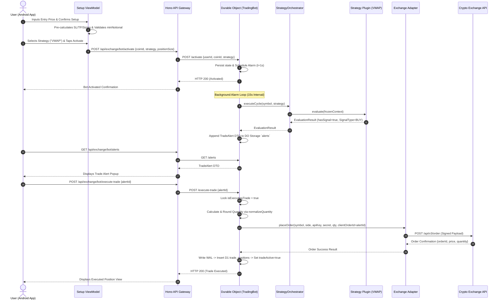

# Trade Lifecycle & Trade Context — Architectural Specification & Execution Walkthrough

> **Document Type:** System Architecture Specification & Execution Blueprint  
> **Target Version:** Version 1.0.0 Frozen Baseline Compliance (Design Blueprint for v1.1+)  
> **Status:** Final Architectural Specification (Documentation Only)  

---

## Executive Summary

Following the completion and freeze of the **Version 1.0.0 Core Platform**, this specification defines the complete end-to-end architecture of the **Trade Lifecycle & Trade Context**.

It details the journey of a trade from the moment a user inputs an **Entry Price** on the Android Trade Setup screen, through automatic parameter calculation, strategy selection, continuous background evaluation in Cloudflare Durable Objects, trade alert generation, and final execution on the connected exchange.

---

## 1. Trade Context Creation & Lifecycle

The **Trade Context** is the primary domain object that encapsulates all metadata, parameters, risk thresholds, and execution state for a trade setup across its lifecycle.

```
+-----------------------------------------------------------------------------------+
|                               TRADE CONTEXT OBJECT                                |
+-----------------------------------------------------------------------------------+
|  Identity & Context : userId, botId, sessionId, exchangeName, environment, region|
|  Instrument         : symbol ("BTC/USDT"), timeframe ("15m")                    |
|  Price Parameters   : entryPrice, currentPrice, stopLoss, takeProfit              |
|  Risk & Sizing      : accountRiskPercent, riskRewardRatio, positionSize, minNotional|
|  Strategy Binding   : strategyId ("VWAP"), strategyVersion ("1.0.0")             |
|  State & Flags      : status ("ACTIVE"), isExecutingTrade, createdAt, updatedAt   |
+-----------------------------------------------------------------------------------+
```

### Context Field Lifespan & Ownership Matrix:

| Field Name | Origin | Primary Owner | Mutability | Lifespan | Storage Location |
| :--- | :--- | :--- | :--- | :--- | :--- |
| `userId` | JWT Auth Claims | API Gateway / DO | Immutable | Lifetime of account | D1 / DO Storage |
| `botId` | DO Namespace (`idFromName`) | Cloudflare Workers | Immutable | Permanent DO instance | DO System Memory |
| `symbol` | User Selection (Top 10) | `TradeSetupViewModel` | Immutable | Bot Session Lifetime | DO Storage / D1 |
| `entryPrice` | User Manual Input | `TradeSetupViewModel` | Immutable | Trade Setup Session | Android Memory -> DO Storage |
| `stopLoss` | Risk Engine Calculation | `RiskEngine` / Strategy | Immutable | Active Trade Lifetime | TradeAlert DTO / DO Storage |
| `takeProfit` | Risk Engine Calculation | `RiskEngine` / Strategy | Immutable | Active Trade Lifetime | TradeAlert DTO / DO Storage |
| `positionSize` | Risk Engine / Sizing | `RiskEngine` | Immutable | Trade Execution | TradeAlert DTO / Order Payload |
| `accountRiskPercent`| User Config / Strategy | Strategy Config | Mutable (v1.1) | Strategy Lifetime | DO Storage / Strategy Config |
| `strategyId` | User Strategy Selection| `StrategyRegistry` | Mutable | Active Run Lifetime | DO Storage (`strategy`) |
| `status` | DO State Machine | `EngineStateMachine` | Mutable | Cycle to Cycle | DO Storage (`engineState`) |

---

## 2. Trade Setup Screen Workflow

The **Trade Setup Screen** is the entry gate where the user specifies the target Entry Price.

```
+-----------------------------------------------------------------------------------+
| 1. User Inputs Entry Price                                                        |
|    User types numeric value (e.g. 50,000.00 USDT) into Trade Setup Form           |
+-----------------------------------------------------------------------------------+
                                          |
                                          v
+-----------------------------------------------------------------------------------+
| 2. Client Pre-Validation & Market Data Query                                      |
|    Client fetches latest ATR(14), account balance, & exchange minNotional limit    |
+-----------------------------------------------------------------------------------+
                                          |
                                          v
+-----------------------------------------------------------------------------------+
| 3. Automatic Calculation Engine (Client Side Pre-Calculation)                     |
|    - Stop Loss (SL)   = EntryPrice - (ATR * 1.5)  [For BUY]                      |
|    - Take Profit (TP) = EntryPrice + (SL_Distance * RiskRewardRatio)             |
|    - Est. Risk/Reward = (TP - Entry) / (Entry - SL)                              |
|    - Est. Position   = Max( (AccountBalance * Risk%) / SL_Distance_Pct, minNotional)|
+-----------------------------------------------------------------------------------+
                                          |
                                          v
+-----------------------------------------------------------------------------------+
| 4. Validation Gatekeeper                                                          |
|    Check: EntryPrice > 0, PositionSize >= minNotional, Account Balance Available  |
+-----------------------------------------------------------------------------------+
                                          |
                                          v
+-----------------------------------------------------------------------------------+
| 5. Confirmation & Navigation                                                      |
|    User confirms Setup -> TradeContext stored in ViewModel -> Navigate to Strategy|
+-----------------------------------------------------------------------------------+
```

### UI Validation Rules:
1. **Entry Price Range Check:** Entry Price must be positive (`> 0`) and within a 20% band of current ticker price to prevent fat-finger inputs.
2. **Minimum Notional Check:** Calculated position size must satisfy `positionSize >= ticker.minNotional`.
3. **Invalid Price Handling:** If user types invalid characters or zero, SL/TP fields display `"--"` and the Next button is disabled.

---

## 3. Object Hierarchy & Lifespan Progression

The object graph transitions sequentially as the trade progresses through its lifecycle:

```
[Android UI] TradeSetup (Transient Form Input)
     |
     v
[Android ViewModel] TradeContext (Client Memory / SavedStateHandle)
     |
     v
[API Payload] BotActivationPayload (Network DTO)
     |
     v
[Durable Object] BotConfiguration & DO Storage (Persistent Memory)
     |
     v
[Engine Alarm Cycle] StrategyContext (Frozen Read-Only Snapshot Context)
     |
     v
[Engine Output] TradeAlert DTO (Pending Confirmation Alert)
     |
     v
[API Payload] OrderExecutionPayload (Network Request)
     |
     v
[Exchange Adapter] Normalized Order Payload (Exchange Specific Format)
     |
     v
[D1 Database & WAL] TradePosition Record (Permanent DB Record)
```

---

## 4. End-to-End State Management Flow

State moves across physical boundaries (Android Client -> Gateway -> Durable Object -> DB) via immutable DTOs:

```
+-----------------------------------------------------------------------------------+
| STATE LAYER            | OBJECT / STATE CONTAINER | PERSISTENCE / SCOPE           |
+-----------------------------------------------------------------------------------+
| Android View           | Compose Form State        | Transient (Screen Life)       |
| Android ViewModel      | StateFlow<TradeSetupState>| ViewModel / SavedStateHandle  |
| Android Repository     | TradeRepository           | In-Memory Cache               |
| Network Layer          | Activation Request DTO    | HTTP Wire Payload             |
| Gateway Service        | Hono Context              | Request Context               |
| Durable Object Storage | DO Storage Keys           | Persistent Cloudflare KV      |
| Durable Object Memory  | StrategyOrchestrator FSM  | DO Instance Memory            |
| Strategy Engine        | Readonly StrategyContext  | Scoped to 1 Cycle Execution   |
| Trade Alert Buffer     | DO `alerts` Array Storage | Persistent in DO KV           |
| Exchange Execution     | Order Result DTO          | Wire Response Payload         |
| Database Storage       | D1 `trade_positions` Table| Permanent Relational Record   |
+-----------------------------------------------------------------------------------+
```

---

## 5. End-to-End Data Flow

```
User Inputs Entry Price (Trade Setup Screen)
   │
   ▼
Client Calculates SL / TP / Risk-Sizing
   │
   ▼
User Confirms Trade Setup & Selects Strategy (Strategy Selection Screen)
   │
   ▼
POST /api/exchange/bot/activate { coinId, strategy, positionSize }
   │
   ▼
API Gateway Fetches User Exchange Keys from D1 DB
   │
   ▼
TRADING_BOTS.get(userId).fetch("http://bot/activate")
   │
   ▼
DO Storage Saved: isActive=true, coinId="BTC/USDT", strategy="VWAP"
   │
   ▼
DO Schedules Immediate Alarm (t + 1000ms)
   │
   ▼
Alarm Loop Fires (Repeats Every 15 Seconds)
   ├─► MarketDataEngine.getSnapshot("BTC/USDT", timeframes)
   ├─► StrategyContext created & frozen (.freeze())
   ├─► StrategyOrchestrator.executeCycle("BTC/USDT", "VWAP")
   └─► VWAPStrategy.evaluate(frozenContext)
   │
   ▼
Condition & Confidence Thresholds Met?
   ├─► NO  : DO updates newAnalysis DTO (State: WAITING, Signal: HOLD)
   └─► YES : Strategy generates TradingSignal (BUY / SELL)
             │
             ▼
DO Appends TradeAlert to Storage `alerts` Array
   │
   ▼
Android App Polls GET /api/exchange/bot/analysis-status
   │
   ▼
UI Displays Trade Alert Popup (Entry, SL, TP, Confidence, Reasoning)
   │
   ▼
User Taps "Confirm Trade"
   │
   ▼
POST /api/exchange/bot/execute-trade { alertId }
   │
   ▼
DO acquires Concurrency Lock (isExecutingTrade = true)
   │
   ▼
DO Reads TradeAlert, Calculates Quantity, Enforces minNotional & lotSize Rounding
   │
   ▼
ExchangeAdapter.placeOrder(symbol, side, apiKey, secret, qty, clientOrderId=alertId)
   │
   ▼
Order Filled on Exchange
   │
   ▼
DO writes Position to WAL (`pendingPositionSync`) -> Async Insert to D1 `trade_positions`
   │
   ▼
DO sets `tradeActive = true` & begins Open Position Monitoring
```

---

## 6. Service Ownership Matrix

| Service / Module | Uses Entry Price | Calculates SL/TP | Reads Trade Context | Updates Trade Context | Executes Orders |
| :--- | :---: | :---: | :---: | :---: | :---: |
| **Android UI / Setup ViewModel** | ✅ | ✅ (Pre-calc) | ✅ | ✅ (Initial) | ❌ |
| **Hono API Gateway** | ❌ (Pass-through) | ❌ | ❌ | ❌ | ❌ |
| **MarketDataEngine** | ❌ | ❌ | ❌ | ❌ | ❌ |
| **IndicatorEngine** | ❌ | ❌ | ❌ | ❌ | ❌ |
| **ConditionEngine** | ❌ | ❌ | ❌ | ❌ | ❌ |
| **ConfidenceEngine** | ❌ | ❌ | ❌ | ❌ | ❌ |
| **RiskEngine** | ❌ (Uses ATR) | ✅ (Distances) | ✅ (RiskContext) | ❌ | ❌ |
| **SignalEngine** | ✅ (Target Entry) | ✅ (Prices) | ✅ (SignalContext)| ❌ | ❌ |
| **Strategy Plugin (e.g. VWAP)**| ✅ (Overextension)| ❌ | ✅ (Snapshot) | ❌ | ❌ |
| **StrategyOrchestrator** | ❌ (Pass-through) | ❌ | ❌ | ❌ | ❌ |
| **TradingBot DO (alarm)** | ✅ | ❌ | ✅ | ✅ | ❌ |
| **TradingBot DO (/execute-trade)**| ✅ | ❌ | ✅ | ✅ | ✅ |
| **ExchangeAdapter** | ✅ (Order Price) | ❌ | ❌ | ❌ | ✅ (Place Order) |

---

## 7. Storage Architecture & Rationale

```
+-----------------------------------------------------------------------------------+
| STORAGE LAYER          | DATA STORED                | RATIONALE / PURPOSE         |
+-----------------------------------------------------------------------------------+
| Android View Memory    | Form Inputs (Entry Price)  | Instant UI responsiveness   |
| SavedStateHandle       | Form State Snapshot        | Survives Android OS process kill |
| Repository Cache       | Ticker & Indicator Cache   | Prevents redundant API calls|
| DO System Memory       | Active Strategy Instance   | Fast in-process cycle eval  |
| DO Key-Value Storage   | `isActive`, `coinId`, `alerts` | Fault-tolerant state storage |
| DO Write-Ahead Log     | `pendingPositionSync`      | Crash recovery before DB write|
| D1 SQLite Database     | `trade_positions`, `audit_log` | Permanent historical record |
| Telemetry Buffer       | Bounded Circular Log       | Real-time operational metrics|
+-----------------------------------------------------------------------------------+
```

---

## 8. Strategy Engine Interaction & Evaluation Semantics

This section clarifies the exact evaluation mechanics of the Strategy Engine regarding price comparison:

```
+-----------------------------------------------------------------------------------+
|                         STRATEGY EVALUATION SEMANTICS                             |
+-----------------------------------------------------------------------------------+
| 1. Current Price vs. Market Data (Pure Analysis Phase):                           |
|    Indicators (RSI, EMA, MACD, ATR, VWAP) are calculated purely from the live     |
|    Candle data in MarketSnapshot. The Entry Price is NOT used for technical       |
|    indicator generation.                                                          |
|                                                                                   |
| 2. Current Price vs. Strategy Rules (Condition & Setup Phase):                   |
|    Strategy rules evaluate whether Current Price crosses VWAP, breaks out of a    |
|    Donchian Channel, or reaches RSI extremes.                                     |
|                                                                                   |
| 3. Current Price vs. Entry Price (Strategy Over-extension Check Phase):           |
|    In strategies like VWAP or Breakout, the engine checks deviation between       |
|    Current Price and Target Entry/VWAP to reject over-extended trades (> 3%).     |
|                                                                                   |
| 4. Signal Generation Phase:                                                       |
|    When conditions & confidence thresholds pass, SignalEngine uses Current Price  |
|    as the reference entry price to apply RiskEngine SL/TP ATR distances.           |
+-----------------------------------------------------------------------------------+
```

---

## 9. Continuous Monitoring Loop

The background execution loop runs entirely within Cloudflare Durable Objects independent of client connectivity.

```
+-----------------------------------------------------------------------------------+
| DURABLE OBJECT ALARM LOOP (Every 15 Seconds)                                      |
+-----------------------------------------------------------------------------------+
| 1. Alarm fires -> DO checks `isActive` in storage (If false, abort).              |
| 2. DO checks `GLOBAL_TRADING_HALT` environment flag (If true, skip).               |
| 3. WAL Recovery check: Process any un-synced `pendingPositionSync` records to D1. |
| 4. DO reads active `coinId` & `strategy` from storage.                            |
| 5. DO fetches live Candles & Tickers via MarketDataEngine.                        |
| 6. DO constructs StrategyContext and calls `frozenContext = context.freeze()`.    |
| 7. StrategyOrchestrator.executeCycle(coinId, strategy) runs selected plugin.      |
| 8. Result transformed to EngineAnalysisDTO and saved to DO storage (`newAnalysis`).|
| 9. If `hasSignal == true` & non-duplicate: Append TradeAlert to DO `alerts` array. |
| 10. `finally` block reschedules alarm for `Date.now() + 15,000ms`.                |
+-----------------------------------------------------------------------------------+
```

---

## 10. Trade Alert Generation & Field Origins

When a strategy evaluation produces a trade signal, a `TradeAlert` DTO is assembled for user confirmation.

```
+-----------------------------------------------------------------------------------+
|                               TRADE ALERT POPUP                                   |
+-----------------------------------------------------------------------------------+
| Field                | Originating Component                                      |
| --------------------+------------------------------------------------------------ |
| Alert ID            | `crypto.randomUUID()` generated by DO                       |
| Symbol ("BTC/USDT") | Active `coinId` from DO storage                            |
| Side ("BUY"/"SELL") | `SignalEngine` output (`signal.type`)                       |
| Entry Price         | Current ticker price from `MarketSnapshot.currentPrice`    |
| Stop Loss           | `SignalEngine` (`entryPrice - riskAssessment.stopLossDist`) |
| Take Profit         | `SignalEngine` (`entryPrice + riskAssessment.takeProfitDist`) |
| Position Size       | `RiskEngine` position sizing recommendation                 |
| Confidence Score    | `ConfidenceEngine` overall score (e.g. 85%)                 |
| Reasoning           | Strategy & Signal Engine explanation string array          |
| Strategy Name       | `StrategyManifest.displayName`                             |
| Timestamp           | ISO Timestamp generated at alert creation time             |
+-----------------------------------------------------------------------------------+
```

---

## 11. Trade Confirmation & Execution Mechanics

When the user taps **"Confirm Trade"** on the mobile alert popup:

1. **Client Dispatches Request:** `POST /api/exchange/bot/execute-trade` with payload `{ alertId }`.
2. **Concurrency Lock:** DO executes inside `blockConcurrencyWhile` and sets `isExecutingTrade = true`.
3. **Alert Retrieval:** DO retrieves target alert from storage `alerts` array and verifies status is `pending` or `acknowledged`.
4. **Credential Decryption:** Gateway/DO fetches user's encrypted exchange secret from D1 DB and decrypts via AES-256-GCM using `ENCRYPTION_KEY`.
5. **Quantity & Precision Rounding:**
   * Raw Quantity = `positionSize / entryPrice`.
   * Order Quantity = `normalizeQuantity(rawQty, ticker.lotSize, ticker.minOrderQty, ticker.maxOrderQty)`.
   * Verifies `positionSize >= ticker.minNotional`.
6. **Idempotent Order Placement:** DO calls `adapter.placeOrder(symbol, side, apiKey, secret, qty, clientOrderId=alertId)`.
7. **Write-Ahead Logging (WAL):** Position metadata written to DO storage `pendingPositionSync` prior to D1 DB insertion.
8. **Position Database Sync:** Position inserted into D1 `trade_positions` table; `pendingPositionSync` cleared upon success.
9. **Monitoring State Activation:** DO sets `tradeActive = true` and enables `monitorOpenPositions()` monitoring loop.

---

## 12. Failure Recovery Matrix

| Failure Event | System Recovery & Resilience Mechanism |
| :--- | :--- |
| **App Closed / Killed** | Execution unaffected. DO continues 15s alarm loop in Cloudflare edge network. Re-opening app fetches state via `/status`. |
| **Device Reboot** | No effect on backend execution. User logs in, app queries `/status`, restores active monitoring state. |
| **Network Interruption** | Client retries API queries. DO alarm loop runs autonomously on Cloudflare edge. |
| **Exchange Timeout** | Adapter throws timeout error. StrategyOrchestrator catches exception, records telemetry event, emits `HOLD` status, reschedules alarm. |
| **Durable Object Eviction** | Cloudflare Workers KV storage retains `isActive`, `coinId`, `strategy`, and `alerts`. Upon revival, storage initializes state and alarm resumes. |
| **Worker Cold Restart** | Immutable `StrategyRegistry` reinstantiates default plugins cleanly upon singleton retrieval. |
| **Duplicate Alert Tap** | `clientOrderId` (Alert UUID) passed to exchange adapter ensures exchange rejects duplicate order submission (Idempotency). |
| **Duplicate Activation Tap** | DO concurrency flag (`isExecutingTrade = true`) rejects duplicate concurrent activation calls with HTTP 409 Conflict. |

---

## 13. System Architecture Sequence Diagram



---

## 14. Component Dependency Graph

```
                                +-----------------------------+
                                |      Android UI Views       |
                                +-----------------------------+
                                               |
                                               v
                                +-----------------------------+
                                |    TradeSetupViewModel      |
                                +-----------------------------+
                                               |
                                               v
                                +-----------------------------+
                                |     TradeRepository DTOs    |
                                +-----------------------------+
                                               |
                                               v
                                +-----------------------------+
                                |      Hono API Gateway       |
                                +-----------------------------+
                                               |
       +---------------------------------------+---------------------------------------+
       |                                       |                                       |
       v                                       v                                       v
+-------------------------------+   +-------------------------------+   +-------------------------------+
| D1 Relational DB              |   | TradingBot Durable Object     |   | Encryption / Decryption Module|
| (user_keys, trade_positions)  |   | (Storage, Alarm, State)       |   | (AES-256-GCM)                 |
+-------------------------------+   +-------------------------------+   +-------------------------------+
                                               |
                                               v
                                +-----------------------------+
                                |    StrategyOrchestrator     |
                                +-----------------------------+
                                               |
       +---------------------------------------+---------------------------------------+
       |                                       |                                       |
       v                                       v                                       v
+-------------------------------+   +-------------------------------+   +-------------------------------+
| MarketDataEngine              |   | StrategyRegistry              |   | Core Engine Pipeline          |
| (Candle Provider)             |   | (Strategy Plugins)            |   | (Indicator, Risk, Signal)     |
+-------------------------------+   +-------------------------------+   +-------------------------------+
                                               |
                                               v
                                +-----------------------------+
                                |   Exchange Adapter Layer    |
                                | (Binance / Delta Exchange)  |
                                +-----------------------------+
```

---

## 15. Independent Architecture Audit & Findings

A read-only architectural audit of the trade lifecycle across the system yields the following findings and governance checks:

### Governance & Compliance Check:
- **Core Engine Freeze:** 100% Compliant. The engine pipeline (`IndicatorEngine`, `ConditionEngine`, `ConfidenceEngine`, `RiskEngine`, `SignalEngine`) remains frozen and unmodified.
- **DTO Boundaries:** 100% Compliant. Communication across physical boundaries utilizes immutable DTOs (`EngineStatusDTO`, `MarketAnalysisDTO`, `SignalDTO`, `StrategyManifestDTO`).
- **Idempotency:** 100% Compliant. `clientOrderId` (Alert UUID) passed to exchange adapters prevents duplicate execution on network retries.

### Architectural Findings & Future Recommendations:

1. **Pre-Trade SL/TP Calculation Unification (Recommendation for v1.1):**
   * *Finding:* `TradeSetupViewModel` on Android performs client-side pre-calculation of SL/TP using local formulas, while `RiskEngine` inside the backend performs ATR-based distance calculations.
   * *Recommendation:* In `v1.1`, update the pre-trade setup screen to call `POST /technical-analysis` to fetch official `RiskEngine` SL/TP distance recommendations, guaranteeing zero divergence between pre-trade setup display and actual strategy execution.

2. **Unified Position Sizing Parameter (Recommendation for v1.1):**
   * *Finding:* Currently, `handleActivateTradingBot` accepts `positionSize` in quote currency (USD/USDT), while `TradingBot.alarm()` uses a default fallback size when generating test alerts.
   * *Recommendation:* Pass the user's configured `positionSize` explicitly into the `TradeAlert` constructor during strategy evaluation to ensure exact risk alignment.

---

## Conclusion & Next Steps

This document completes the architectural walkthrough for the entire trade lifecycle from **Entry Price Input -> Setup -> Strategy Selection -> Analysis -> Trade Alert -> Exchange Order Execution**.

With this blueprint established alongside the frozen **Version 1.0.0 Baseline**, implementation of the UI module can proceed sprint by sprint with complete architectural alignment.
